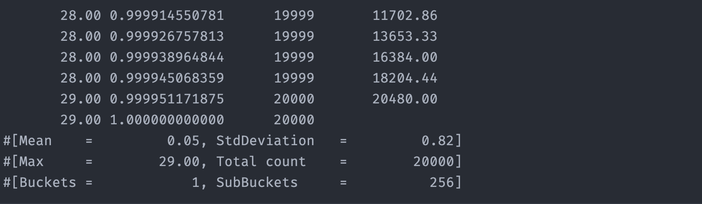

## Low-Latency Messaging Benchmarks with Aeron (Java)

End-to-end design and evaluation of a **low-latency messaging pipeline** using [Aeron](https://github.com/real-logic/aeron).  
The project implements **publish/subscribe** flows with **unicast**, **multicast**, and **IPC** transports, and then benchmarks their **latency distributions** and **accumulated latency** under realistic, high-throughput load — a scenario directly inspired by **market data distribution** and **electronic trading** systems.

The focus is not only on “making it work”, but on **understanding the performance trade-offs** (latency, throughput, back-pressure, and message loss) that matter in production-grade **Fintech infrastructure**.

---

## Slide-Like Walkthrough

GitHub renders images inline, so this repository doubles as a **scrollable slide deck**:

- Guided Aeron setup, publisher/subscriber diagrams, and logs.
- Percentile distributions and summary tables for each scenario.
- Comparative plots for **unicast vs multicast vs IPC** at different loads.

To get a slide-style experience, embed any of the exported pages from the report:

```markdown



```

You can navigate through the `screenshots/` folder to select the most representative pages you want to showcase on GitHub.

---

## Context and Objectives

**Why this project exists**

In modern **capital markets**, trading platforms need to:

- Ingest and broadcast **market data** (prices, quotes, trades) with **microsecond–millisecond latency budgets**.
- Choose appropriate transports — **unicast**, **multicast**, or **IPC** — depending on topology and risk constraints.
- Control **back-pressure**, **queue growth**, and **message loss** under bursty workloads.

This project builds a **minimal, yet realistic Aeron-based testbed** that:

- Implements **Aeron drivers**, **simple publishers/subscribers**, and **latency-aware publishers/subscribers**.
- Follows a guided path: from “Hello World” over Aeron to **timestamped messages**, **HdrHistogram-based** analysis, and **transport comparison**.
- Produces a structured report (PDF + images) with **percentile distributions** and **qualitative conclusions**.

Technologies:

- **Language**: Java (Maven project)
- **Messaging library**: Aeron
- **Metrics**: HdrHistogram (`ConcurrentHistogram`)
- **Patterns**: Publish/Subscribe, polling with `FragmentHandler`, back-pressure handling

---

## Architecture Overview

### Media Drivers

Two driver configurations are provided under `driver/`:

- **`LowLatencyMediaDriver`**
  - Dedicated threading model (`ThreadingMode.DEDICATED`).
  - Aggressive idle strategies (`BusySpinIdleStrategy`, `NoOpIdleStrategy`) to continuously poll buffers.
  - Optimised for **lowest possible latency**, trading off high CPU usage (multiple cores at ~100%).

- **`BackOffMediaDriver`**
  - Shared threading (`ThreadingMode.SHARED`).
  - `BackoffIdleStrategy` to reduce CPU consumption when no messages are pending.
  - Suitable when **resource efficiency** is more important than absolute minimum latency.

This mirrors real-world infrastructure decisions in trading:  
**“Do we dedicate cores to market data?” vs “Do we share cores and accept extra jitter?”**

### Messaging Components

- **Common configuration – `Constants`**
  - Controls global test parameters such as:

    ```java
    static final int MAX_EXECUTIONS_PER_SECOND = 100000;
    static final long EXPECTED_TIME_BETWEEN_CALLS =
        TimeUnit.SECONDS.toMillis(1) / MAX_EXECUTIONS_PER_SECOND;
    static final int NUM_MESSAGES = 200000;

    // Channels:
    // "aeron:ipc"
    // "aeron:udp?endpoint=224.0.1.1:40456" (multicast)
    // "aeron:udp?endpoint=localhost:40456" (unicast)
    static final String CHANNEL = "aeron:ipc";
    static final int STREAM_ID = 1001;
    ```

  - Encodes the **three benchmark batteries** (commented presets) and the selected transport (unicast/multicast/IPC).

- **Guided “Hello Aeron” flows**
  - `SimplePublisher` and `SimpleSubscriber` implement:
    - Aeron context and `Aeron.connect(ctx)` lifecycle.
    - `Publication` and `Subscription` setup from `Constants.CHANNEL` and `STREAM_ID`.
    - Non-blocking `offer` semantics with detailed back-pressure diagnostics:
      - `BACK_PRESSURED`, `NOT_CONNECTED`, `ADMIN_ACTION`, `CLOSED`.
    - `FragmentHandler`-based polling on the subscriber side.

  This corresponds directly to the guided steps:
  - Start Media Driver.
  - Create Aeron context.
  - Connect (`Aeron.connect`).
  - Add publication/subscription.
  - Implement `FragmentHandler` and `subscription.poll(...)`.
  - Treat logs as the first “sanity check” on message flow.

- **Latency-aware components**
  - `LatencyPublisher`
    - Generates **timestamped messages** at a precise rate:

      ```java
      long nextCallTime = System.currentTimeMillis();
      for (int i = 0; i < Constants.NUM_MESSAGES; i++) {
          while (System.currentTimeMillis() < nextCallTime) { /* busy wait */ }

          long delay = System.currentTimeMillis() - nextCallTime;
          long currTime = System.currentTimeMillis();
          String message = delay + "|" + currTime;
          ...
          long result = publication.offer(buffer, 0, messageBytes.length);
          ...
          nextCallTime += Constants.EXPECTED_TIME_BETWEEN_CALLS;
      }
      ```

    - Encodes:
      - **Scheduling delay** (`delay`): how late the publisher is relative to its ideal send time.
      - **Send timestamp** (`currTime`): used by the subscriber to compute one-way latency.
    - Handles back-pressure and connectivity with explicit logging, which is critical for high-throughput systems.

  - `LatencySubscriber`
    - Consumes messages, parses delay and send time, and records both **raw** and **accumulated** latency:

      ```java
      String[] parts = rcvMessage.split("\\|");
      long delayMs = Long.parseLong(parts[0]);
      long sendTimeMs = Long.parseLong(parts[1]);

      long nowMs = System.currentTimeMillis();
      long latencyMs = nowMs - sendTimeMs;
      long accumulatedLatencyMs = latencyMs + delayMs;

      histogram.recordValue(latencyMs);
      histogramAcc.recordValue(accumulatedLatencyMs);
      ```

    - Uses `ConcurrentHistogram` from HdrHistogram for:
      - **Latency distribution** (per message).
      - **Accumulated latency** accounting for scheduling delays and queueing.
    - Controls lifecycle via `SigInt` and an `AtomicBoolean`, cleanly shutting down after the expected number of messages.

This design closely reflects how **real trading gateways and market data handlers** instrument and reason about performance.

---

## Benchmark Scenarios

Three main “batteries” of tests are configured via `Constants`:

### Battery 1 – Baseline Load

- **Messages**: 20,000  
- **Rate**: 1,000 messages/second  
- **Transports**:
  - Unicast: `aeron:udp?endpoint=localhost:40456`
  - Multicast: `aeron:udp?endpoint=224.0.1.1:40456`
  - IPC: `aeron:ipc`

**Goal**: Establish a clean baseline with **decisecond-level latencies**, minimal queueing, and no message loss.

### Battery 2 – High Load

- **Messages**: 20,000  
- **Rate**: 50,000 messages/second  
- **Transports**: same three as above.

**Goal**: Observe:

- **Queue build-up**.
- Divergence between **latency** and **accumulated latency**.
- How back-pressure behaves, and which transports cope better as the system is pushed.

### Battery 3 – Extreme Load

- **Messages**: 200,000  
- **Rate**: 100,000 messages/second  
- **Channel**: e.g. `aeron:udp?endpoint=localhost:40456` plus IPC runs.

**Goal**: Force the system into a regime where:

- **Messages are intentionally lost** on some transports (back-pressure and overload).
- **IPC** stands out as the transport that **does not lose messages**, even if its average latency metrics appear worse under full saturation.

---

## Key Results and Observations

From the report and experiments:

- **Battery 1 (20k @ 1k msgs/s)**  
  - All transports deliver **very low latencies** (fractions of a second).
  - Ordering by speed: **IPC fastest**, **Unicast next**, **Multicast last**.
  - Multicast incurs extra protocol overhead, which is not compensated when there is only a single subscriber.

- **Battery 2 (20k @ 50k msgs/s)**  
  - Clear jump in both **average latency** and **accumulated latency** across all transports.
  - Accumulated latency distributions reveal **queueing effects** that average numbers alone would hide.
  - IPC remains the most robust in terms of latency under high load, followed by Unicast, then Multicast.

- **Battery 3 (200k @ 100k msgs/s)**  
  - System runs with **large, persistent queues** and **significantly higher latencies**.
  - Some transports begin to **drop messages** to cope with the load.
  - **IPC appears worst in raw average latency**, but only because:
    - **IPC is the only transport that does not lose messages.**
  - In a financial context, accepting message loss to show “better” average latency is **not acceptable** for market data feeds or order routing.

**Fintech takeaway:**  
Any meaningful performance evaluation must combine:

- **Latency distributions** (percentiles, not just mean).
- **Accumulated latency** and queueing behaviour.
- **Message integrity** (loss vs no loss).

In trading environments, we choose the configuration where **no prices are dropped**, even at the cost of higher mean latency under stress.

---

## How to Run the Experiments

> Note: The exact commands depend on your local Java/Maven setup. The logical order is:

1. **Start a Media Driver**
   - For maximum performance (strong hardware):

     ```bash
     # Low latency driver: dedicated threads, busy spinning
     java com.cnebrera.uc3.tech.lesson3.driver.LowLatencyMediaDriver
     ```

   - For more modest hardware:

     ```bash
     # Backoff driver: shared threads, reduced CPU usage
     java com.cnebrera.uc3.tech.lesson3.driver.BackOffMediaDriver
     ```

2. **Configure the scenario in `Constants`**
   - Set `NUM_MESSAGES` and `MAX_EXECUTIONS_PER_SECOND` for:
     - Battery 1 (20k, 1k/s)
     - Battery 2 (20k, 50k/s)
     - Battery 3 (200k, 100k/s)
   - Select channel:
     - `aeron:udp?endpoint=localhost:40456` (unicast)
     - `aeron:udp?endpoint=224.0.1.1:40456` (multicast)
     - `aeron:ipc` (IPC)

3. **Run the latency subscriber**

   ```bash
   java com.cnebrera.uc3.tech.lesson3.LatencySubscriber
   ```

4. **Run the latency publisher**

   ```bash
   java com.cnebrera.uc3.tech.lesson3.LatencyPublisher
   ```

5. **Inspect logs and histograms**
   - Logs include:
     - Back-pressure and connection diagnostics.
     - `HdrHistogram` percentile distributions for:
       - **Latency**.
       - **Accumulated latency**.

6. **Repeat** for each battery and transport, capturing screenshots of:
   - `Constants` configuration.
   - Histogram outputs and summary statistics.

---

## What a Recruiter Should Notice

- **Domain relevance (Fintech / Low-Latency)**  
  - The project mirrors concerns of **electronic trading**, **market data distribution**, and **order routing**:
    - Latency vs throughput.
    - Back-pressure and queueing.
    - Message loss vs integrity.

- **System-level thinking**  
  - Clear understanding of how to:
    - Configure drivers for **low latency vs resource efficiency**.
    - Use **polling, idle strategies, and non-blocking APIs**.
    - Instrument flows with **timestamps and histograms**.

- **Experimental rigor**  
  - Structured benchmark design (three batteries, multiple transports).
  - Focus on **percentiles and accumulated latency**, not just raw averages.
  - Correct interpretation of counterintuitive results (e.g., IPC “worse” average latency when it is the **only lossless** option).

For a role involving **low-latency Java**, **trading infrastructure**, or **performance engineering**, this project demonstrates both **hands-on implementation** and the **analytical mindset** required to design, measure, and reason about real-world systems.

