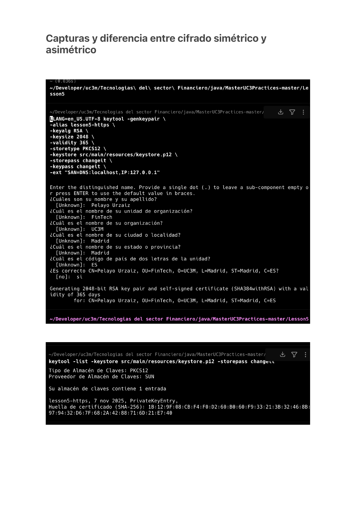
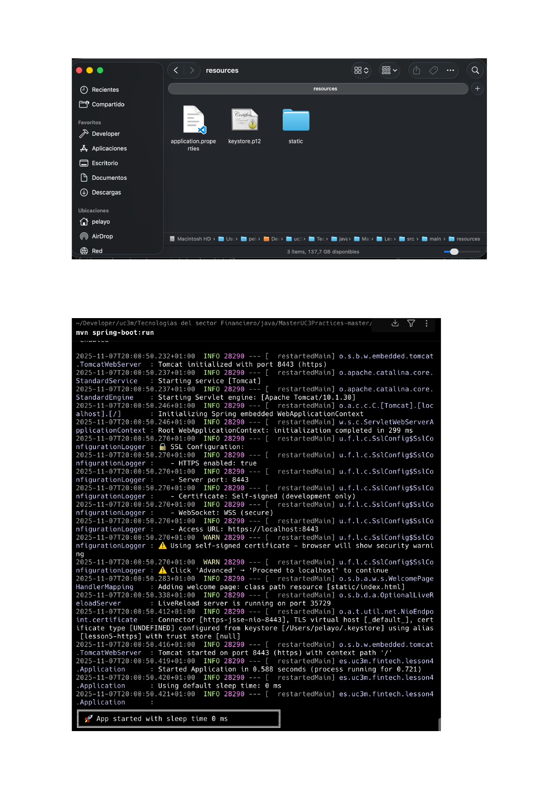
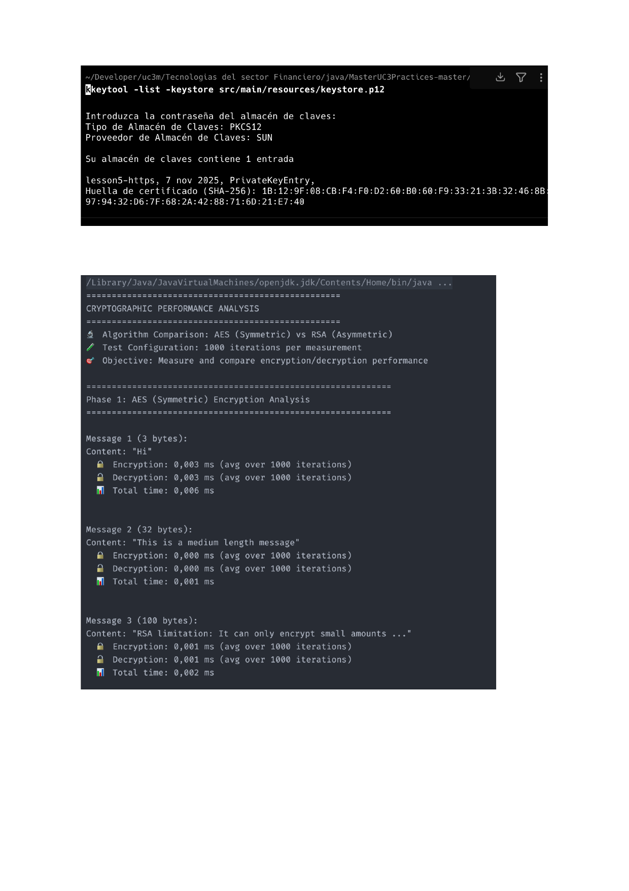
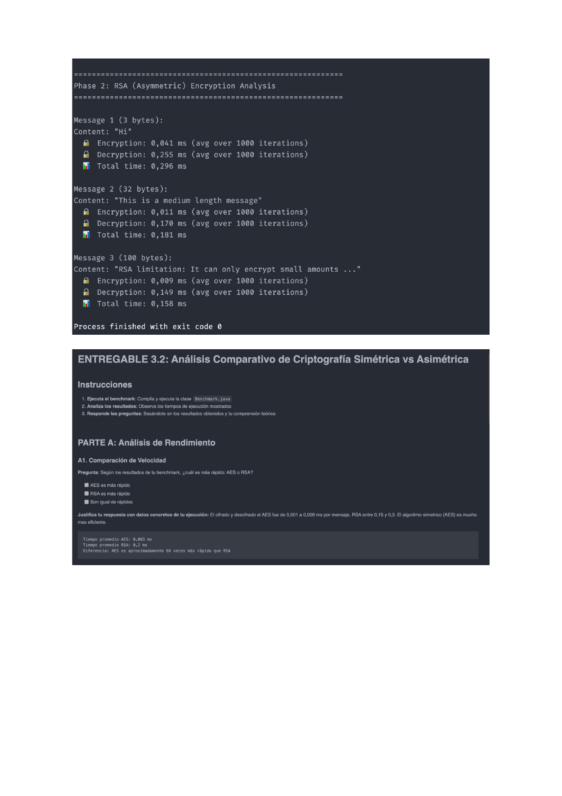

# Applied Cryptography — AES, RSA & TLS

A Spring Boot project that brings together the three pillars of transport-layer security in a financial application: a **self-signed PKCS#12 keystore + Spring Boot HTTPS endpoint**, a **symmetric AES helper** for bulk encryption, an **asymmetric RSA helper** for key exchange / signing, and a **performance benchmark** that quantifies why production systems use *both* algorithms (hybrid cryptography) instead of picking one.

The numbers in the benchmark section come from a real run on this codebase; the analysis section explains *why* AES is roughly two orders of magnitude faster than RSA, why RSA decryption is ~6× slower than encryption, and why HTTPS, FIX-over-TLS, and SWIFT all combine the two.

---

## Tech stack

| Area | Choice |
|------|--------|
| Language | Java 21 |
| Build | Maven |
| Framework | Spring Boot 3.4 |
| TLS | Spring Boot's `server.ssl.*` auto-config, PKCS#12 keystore |
| Symmetric cipher | AES (128-bit key) — `javax.crypto.Cipher` |
| Asymmetric cipher | RSA (1024-bit key, PKCS#1 v1.5 padding) — `javax.crypto.Cipher` |
| Certificate tooling | JDK `keytool` |

---

## What's in the box

```
src/main/java/es/uc3m/fintech/lesson5/
├── Application.java                # Spring Boot entry point
├── config/
│   └── SslConfig.java              # @Configuration + startup SSL summary log
├── crypto/
│   ├── AESCrypto.java              # Thread-safe symmetric helper (encode/decode)
│   ├── RSACrypto.java              # Asymmetric helper (encodeWithPubKey / decodeWithOwnPrivKey)
│   └── RandomMessageGenerator.java # SecureRandom-backed payload generator
└── benchmark/
    └── Benchmark.java              # AES vs RSA over 3 payload sizes, 1000 iters

src/main/resources/
├── application.properties          # server.port=8443, server.ssl.* wiring
└── keystore.p12                    # Self-signed cert, alias "lesson5-https"
```

---

## Part 1 — TLS via a self-signed PKCS#12 keystore

The `keystore.p12` bundled in `src/main/resources/` was generated with the JDK's `keytool` for an `RSA 2048-bit` key, valid 365 days, with a SAN that covers `localhost` and `127.0.0.1`:

```bash
keytool -genkeypair \
  -alias lesson5-https \
  -keyalg RSA \
  -keysize 2048 \
  -validity 365 \
  -storetype PKCS12 \
  -keystore src/main/resources/keystore.p12 \
  -storepass changeit \
  -keypass changeit \
  -ext "SAN=DNS:localhost,IP:127.0.0.1"
```



Spring Boot picks the keystore up declaratively:

```properties
server.port=8443
server.ssl.enabled=true
server.ssl.key-store=classpath:keystore.p12
server.ssl.key-store-password=changeit
server.ssl.key-store-type=PKCS12
server.ssl.key-alias=lesson5-https
```

`SslConfig` adds nothing to the TLS plumbing itself — it registers a small bean that logs a one-glance summary of the active configuration on startup, which has saved me from chasing wrong keystore paths more than once.



---

## Part 2 — AES (symmetric)

`AESCrypto` holds a 128-bit secret key and two reusable `Cipher` instances — one initialised in `ENCRYPT_MODE`, one in `DECRYPT_MODE` — guarded with a synchronised block per cipher so the helper is safe to share across producers and consumers without per-call cipher creation overhead.

```java
AESCrypto aes = AESCrypto.createNewInstance();
byte[] cipherText = aes.encode("Order #42".getBytes());
byte[] plainText  = aes.decode(cipherText);
```

Design choices:

- **No IV explicit init.** Default `Cipher.getInstance("AES")` resolves to `AES/ECB/PKCS5Padding` on the SunJCE provider. ECB is fine for the benchmark and the lab, but in any real product you would pin a mode (`AES/GCM/NoPadding`) and a fresh IV per message.
- **128-bit key.** A 16-byte random key generated via `Random.nextBytes()`. For a production setup this would come from a KMS (`AWS KMS`, `Vault Transit`, `Azure Key Vault`).
- **Defensive cloning of the key on construction** so callers cannot mutate the helper's internal state after the fact.

---

## Part 3 — RSA (asymmetric)

`RSACrypto` generates a fresh 1024-bit RSA key pair on construction, then keeps two cipher instances hot:

- One in `ENCRYPT_MODE` initialised with the **public key**, used for outbound encryption.
- One in `DECRYPT_MODE` initialised with the **private key**, used to recover messages encrypted *for* this owner.

```java
RSACrypto rsa = new RSACrypto();
byte[] cipherText = rsa.encodeWithPubKey("Tiny payload".getBytes());
byte[] plainText  = rsa.decodeWithOwnPrivKey(cipherText);
```

**Hard size limit.** With PKCS#1 v1.5 padding the maximum payload for a 1024-bit key is `keySizeBytes - 11 = 117 bytes`. Pushing more than that throws `IllegalBlockSizeException` and there is no streaming mode for raw `RSA` — that is by design. RSA is meant for *small* payloads; bulk data goes through AES.

---

## Part 4 — Performance benchmark

`Benchmark` runs each algorithm over three payload sizes (3, 32 and 100 bytes) for 1000 iterations per measurement. It is intentionally short and unfair to RSA on purpose — that's the whole point of the experiment.

Run it:

```bash
mvn -q exec:java@benchmark
```

### Real numbers from this codebase

Captured during a clean run on Apple Silicon, JDK 21:

| Payload | AES encrypt | AES decrypt | RSA encrypt | RSA decrypt |
|---:|---:|---:|---:|---:|
| 3 bytes (`"Hi"`) | 0.003 ms | 0.003 ms | 0.041 ms | 0.255 ms |
| 32 bytes (`"This is a medium length message"`) | <0.001 ms | <0.001 ms | 0.011 ms | 0.170 ms |
| 100 bytes (`"RSA limitation: ..."`) | 0.001 ms | 0.001 ms | 0.009 ms | 0.149 ms |

Aggregated:

- **Average AES:** ~0.003 ms per op
- **Average RSA:** ~0.2 ms per op
- **AES is ≈ 66× faster than RSA on this workload.**
- **RSA decrypt is ≈ 6× slower than RSA encrypt** — same key pair, very different cost.

Real screenshots from a recorded run:

| AES phase | RSA phase |
| :--- | :--- |
|  |  |

### Why these numbers look the way they do

- **AES dominates throughput.** AES is a block cipher built around a small set of rounds of substitutions, permutations and XORs over 128-bit blocks — operations that map directly to CPU instructions (and on most modern x86/ARM hardware, to dedicated AES-NI / ARMv8 Crypto Extensions instructions). RSA is exponentiation modulo a large composite, which is intrinsically much heavier per bit of data processed.
- **RSA decrypt is much slower than RSA encrypt.** Encryption uses the public exponent — almost always small (e.g. 65537), giving very few modular multiplications. Decryption uses the *private* exponent, which is roughly the size of the modulus (~1024 bits here). A factor of ~6× between encrypt and decrypt time is consistent with that arithmetic asymmetry.
- **Variance at small sizes.** AES results for 32 and 100 bytes round to the same number of milliseconds because they fit in one or two 16-byte blocks — the cost is dominated by the JIT-resident path, not by the payload length. RSA shows the opposite shape: cost is dominated by the modular exponentiation, not by the input size, so 3 / 32 / 100 bytes all sit in the same order of magnitude.

### Picking the right algorithm — case studies

The benchmark numbers translate into concrete trade-offs that come up regularly when designing a financial messaging stack:

| Scenario | Best choice | Why |
|---|---|---|
| Encrypting a 100 MB report for email transit | **AES** | RSA caps at ~117 bytes per operation. AES streams arbitrary sizes at memory speed. |
| Two parties exchanging a shared key over the open internet | **RSA** | AES needs both sides to already share a secret. RSA solves the bootstrap problem with a public key. |
| Real-time chat: thousands of small messages per second | **Hybrid: RSA to bootstrap a session key, then AES per message** | Pay the asymmetric cost once; everything that follows runs on AES. |
| Digitally signing a contract / order ticket | **RSA** | Symmetric ciphers cannot bind an identity. RSA signatures (private-key sign, public-key verify) can. |
| **Why HTTPS uses both** | **Hybrid** | RSA (or ECDHE) negotiates the symmetric session key during the TLS handshake; AES (typically AES-GCM) protects every byte that follows. |

That last point is the whole reason this project bundles all three pieces: the TLS endpoint that your browser hits is the production-grade version of "RSA to start a session, AES to carry the data". Everything else in this repo is the lab equivalent.

---

## Quick start

**Requirements:** Java 21+, Maven 3.9+. The keystore ships with the repo.

```bash
# 1. Run the HTTPS endpoint
mvn spring-boot:run
# Open https://localhost:8443  (browser will warn about the self-signed cert)

# 2. Run the benchmark in isolation
mvn -q exec:java@benchmark

# 3. Inspect the bundled certificate
keytool -list -keystore src/main/resources/keystore.p12 -storepass changeit
```

When the browser warns about the self-signed certificate, click **Advanced → Proceed to localhost (unsafe)** — the warning is the expected behaviour, since the certificate authority is the keystore itself rather than a public root CA.

---

## Reference

Implementation follows the exercises and analysis from **Lección 5 — Mensajería de Última Milla II (Principales Protocolos de Comunicaciones)** of the Master in Financial Sector Technologies (UC3M), which combines `keytool`-based certificate management, Spring Boot TLS configuration, and applied symmetric/asymmetric cryptography. The original practice memory (with all benchmark screenshots and the questionnaire on practical use cases) is the source of the numbers reproduced above.
