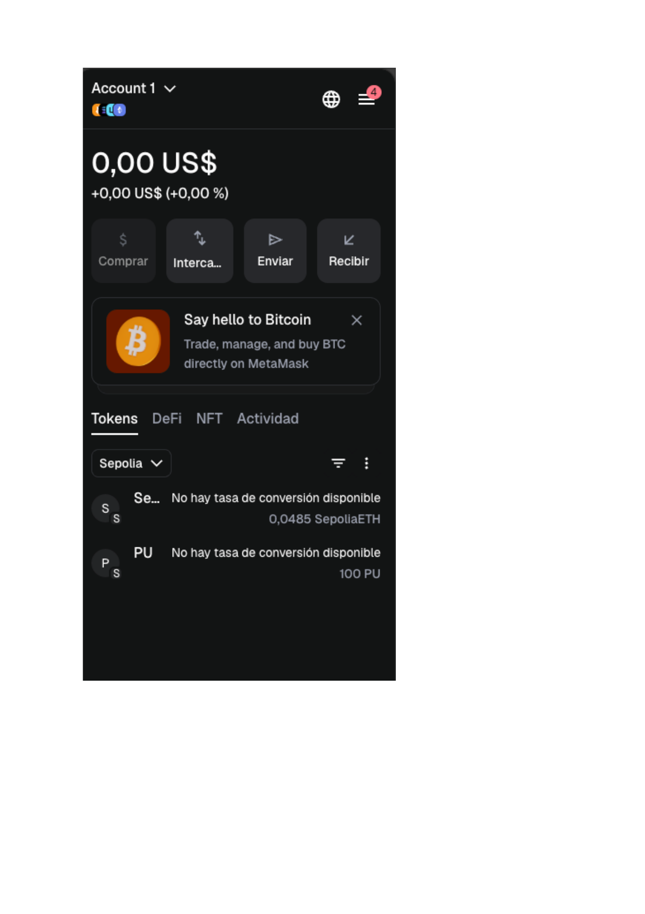

# Blockchain in Capital Markets — Applied Research Note

End-to-end exploration of the **Ethereum smart-contract toolchain** as it is used in capital-markets engineering: from a Solidity reading of a voting contract (`Ballot.sol`), through deploying an ERC-20 token in the **Remix IDE** against a local VM, to deploying the same kind of contract on the **Sepolia testnet** with a real **MetaMask** wallet, a real **HD seed phrase**, and real funds drawn from a faucet.

The deployment is **publicly verifiable on-chain** — the contract addresses, transaction hashes and block numbers below all resolve on `sepolia.etherscan.io`.

---

## TL;DR

| Track | What was tested | Verifiable artefact |
|---|---|---|
| **Theory — Solidity primitives** | 5 reading items on a voting contract (`Ballot.sol`): right-to-vote conditions, delegation loops, vote weight transfer, array-bounds errors, bytes32 vs string trade-off. | All 5 answers documented in the table below. |
| **Local deployment — ERC-20 in Remix** | Deployed `MyToken` (Solidity 0.8.x ERC-20 from OpenZeppelin) to Remix's in-memory VM; verified `name()` and `symbol()` calls. | Transaction status, contract address, screenshot of `name()` returning `"PelayoToken"` and `symbol()` returning `"PU"`. |
| **Public testnet — Sepolia** | Created an HD MetaMask wallet, funded it from a Sepolia faucet, deployed the ERC-20 there, observed the token balance live in MetaMask. | All hashes/addresses below; **on-chain proof on Etherscan**. |

---

## Verifiable on-chain artefacts (Sepolia)

| Item | Value |
|---|---|
| **ERC-20 contract** | `0x9687A7cAe5b783b60eA0386537fdFf2ad8AAF427` |
| **Deployment tx hash** | `0x23e43108437614de0720406c7ff3b48385d8c78cc2ce513cc3384564efdbd89` |
| **Block number** | `9980306` |
| **Contract on Etherscan** | <https://sepolia.etherscan.io/address/0x9687A7cAe5b783b60eA0386537fdFf2ad8AAF427#events> |
| **Faucet receipt tx** | <https://sepolia.etherscan.io/tx/0x9f789d1fb323b1f411a6b367813b820349bf4171d4f597107f89dec3cd7ccb09> |
| **Token symbol / supply observed in MetaMask** | `PU`, balance `100 PU` plus `0.0485 SepoliaETH` |

A reviewer can paste the contract address into Etherscan and confirm the deployment, the bytecode, and any subsequent `Transfer` events, without needing to clone or run anything locally.

---

## Track 1 — Solidity primitives (Ballot.sol)

A common-sense pen-and-paper reading of the canonical voting contract bundled in Solidity's documentation. The five-question quiz tests *exactly* the kind of subtleties that show up when auditing third-party contracts:

| # | Question | Answer | Why |
|---:|---|---|---|
| 1 | When can `giveRightToVote()` legitimately enfranchise a voter? | The voter has not voted yet **and** their `weight == 0`. | Both checks together protect against double-grant: voting flips the `voted` flag; non-zero weight means the right is already granted. |
| 2 | Why does `delegate()` use a `while` loop? | To resolve **transitive delegations** safely while breaking out on **cyclic / self-delegations** (would otherwise infinite-loop on-chain — and burn all gas). |
| 3 | What happens if a delegate has already voted? | The delegator's voting weight is **added to the proposal the delegate already voted for**, not re-emitted. Saves gas, preserves the integrity of the tally. |
| 4 | Voting for a non-existent proposal index? | The runtime **reverts the entire transaction** (out-of-bounds access in Solidity 0.8+ is a panic, all state changes roll back). |
| 5 | Why hex-encode proposals into `bytes32`? | `bytes32` is a **fixed-size, gas-efficient** type. Solidity requires literal byte values to be passed as hex — strings would balloon storage cost and require dynamic length handling. |

### Why this matters in capital markets

Permissioned voting / delegation patterns are precisely the building blocks of on-chain governance for tokenised securities, DAO-managed treasuries and consortium-style settlement networks. The four mechanics above — non-replayable enfranchisement, cycle-safe delegation, weight aggregation on already-voted delegates, and revert-on-bad-input — recur in every audit checklist for that kind of contract.

---

## Track 2 — `MyToken` ERC-20 in Remix

The second track moves from reading to deploying: a minimal ERC-20 (`MyToken`, named **PelayoToken** with symbol **PU**) was compiled with Solidity `^0.8.0` against OpenZeppelin's standard library and deployed to the Remix in-memory EVM. Two read-only calls (`name()` and `symbol()`) confirm the constructor wired the metadata correctly.

The Remix transaction log showed the canonical fields any block explorer surfaces — status, transaction hash, block hash, block number, contract address — establishing the mental model used in Track 3 against a real chain.

### What changes vs the local VM

Going from Remix's local VM to a public testnet introduces three new constraints that don't exist in-memory:

- **Gas is real.** Every `SSTORE` and every byte of bytecode costs SepoliaETH (or real ETH on mainnet). This is what makes `bytes32 > string` a recurring optimisation in production contracts.
- **Block confirmation is asynchronous.** Tx status `pending → success` takes 12–15 seconds per block on Sepolia; UI code has to handle the wait.
- **Address ownership is custodial.** The signer's private key controls who can call privileged functions. In Track 3 that signer is MetaMask, derived from a 12-word seed phrase — discussed below.

---

## Track 3 — MetaMask + Sepolia public deployment

The same ERC-20 was deployed to the Sepolia testnet from a freshly created MetaMask wallet, after funding it via a faucet.

### Hierarchical-deterministic wallets, in one paragraph

A **deterministic wallet** is one in which every key (and therefore every account address) is derived mathematically from a single root, instead of being generated and stored independently. The 12- or 24-word **seed phrase** ("mnemonic") is the human-readable encoding of that root: feed it back into a compatible wallet and the same derivation recomputes byte-for-byte the same private keys, the same public keys, and the same addresses you had before. That is why a single seed phrase can recover *every* account ever derived from that wallet — there is no per-account secret to lose. The flip side is that the seed phrase **is the wallet**: anyone who has it owns every key it derives, forever.

In production custody (institutional, custodial exchanges, regulated stablecoin issuers), this pattern is enforced through HSMs, MPC schemes, or social-recovery wallets. The fundamentals are the same; the seed phrase moves from "post-it on a desk" to "shards across geographically distributed signers".

### Funding via faucet

Sepolia is a public testnet, so SepoliaETH is free but rate-limited. The faucet drop is itself an on-chain transaction:

> <https://sepolia.etherscan.io/tx/0x9f789d1fb323b1f411a6b367813b820349bf4171d4f597107f89dec3cd7ccb09>

Once that transaction confirmed, MetaMask reflected a non-zero `SepoliaETH` balance and the wallet was usable as a deployer.

### Contract deployment + post-deployment verification

Deployment was driven from Remix using **Injected Provider — MetaMask**, signing the deploy transaction with the wallet's private key. The contract resolved to:

- **Address:** `0x9687A7cAe5b783b60eA0386537fdFf2ad8AAF427`
- **Block:** `9980306`
- **Etherscan:** <https://sepolia.etherscan.io/address/0x9687A7cAe5b783b60eA0386537fdFf2ad8AAF427#events>

After deployment, the ERC-20 token was added to MetaMask under its custom-tokens registry; the balance updated immediately:

This is the canonical end-to-end flow used by stablecoin issuers, tokenised-asset platforms and L2 bridges to bring a new token live on a chain.

---

## What I'm taking away

1. **The on-chain artefact is the deliverable.** Unlike a typical software project, a smart-contract exercise produces *public, immutable evidence* — a contract address, a transaction hash, a block number — that anyone with a browser can verify. That is the same property that makes blockchain attractive for post-trade settlement: the audit trail is the system, not a side-effect of it.
2. **Gas-aware data modelling is non-optional.** The `bytes32` vs `string` question in the quiz is a microcosm of every Solidity design call: pick the cheapest representation that fits the domain, or pay for it on every transaction forever.
3. **HD wallets are the user-facing face of asymmetric cryptography.** The same RSA / ECC primitives benchmarked in [`applied-cryptography-aes-rsa-tls`](../applied-cryptography-aes-rsa-tls) are what makes a 12-word seed phrase able to regenerate an entire address book deterministically. The seed is the secret; everything else is derived.
4. **Testnets are real practice.** Going from Remix's local VM to Sepolia exposed the asynchrony, the gas economy, and the custodial discipline that don't appear in unit tests. The deploy-fund-verify loop is the same on mainnet — just with real money and a longer post-mortem if you get it wrong.

---

## Reference

Built in the context of the *Blockchain* module, MSc in Financial Sector Technologies (UC3M).
