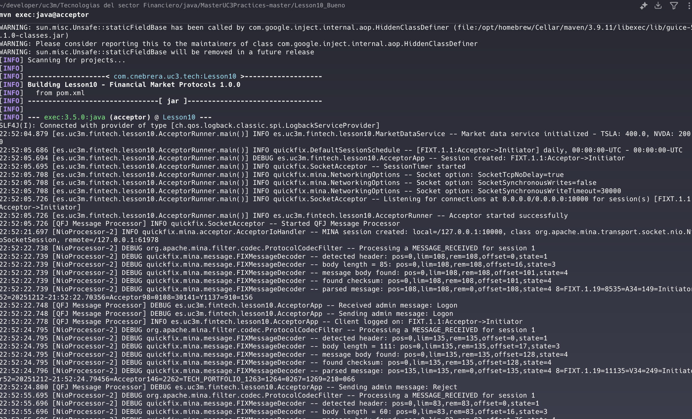
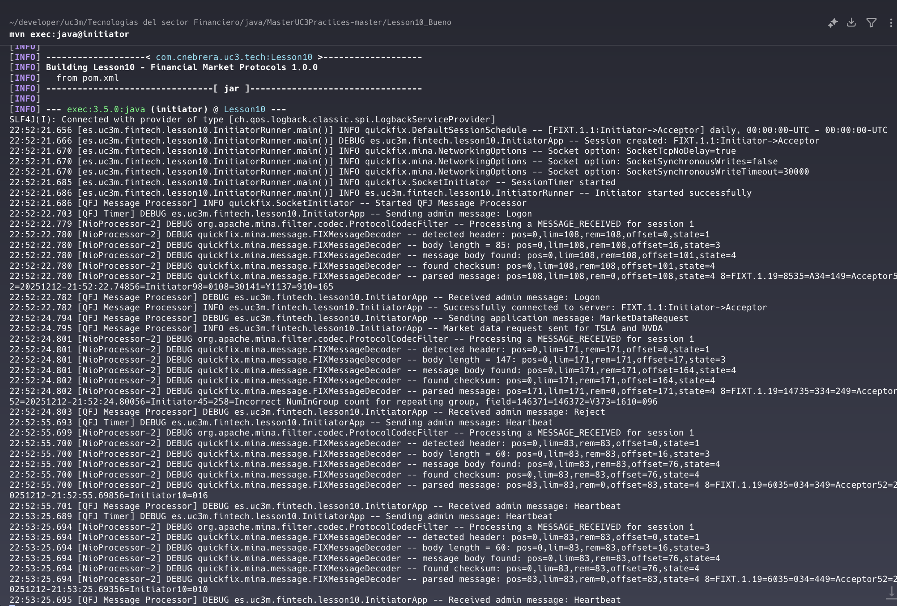
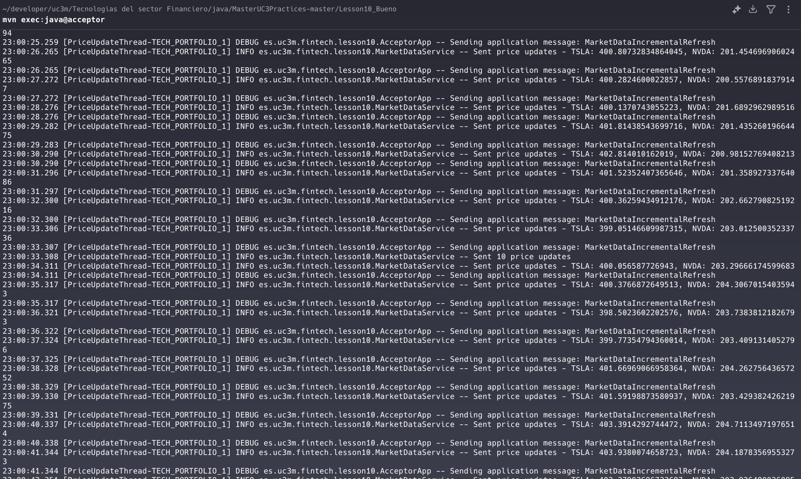
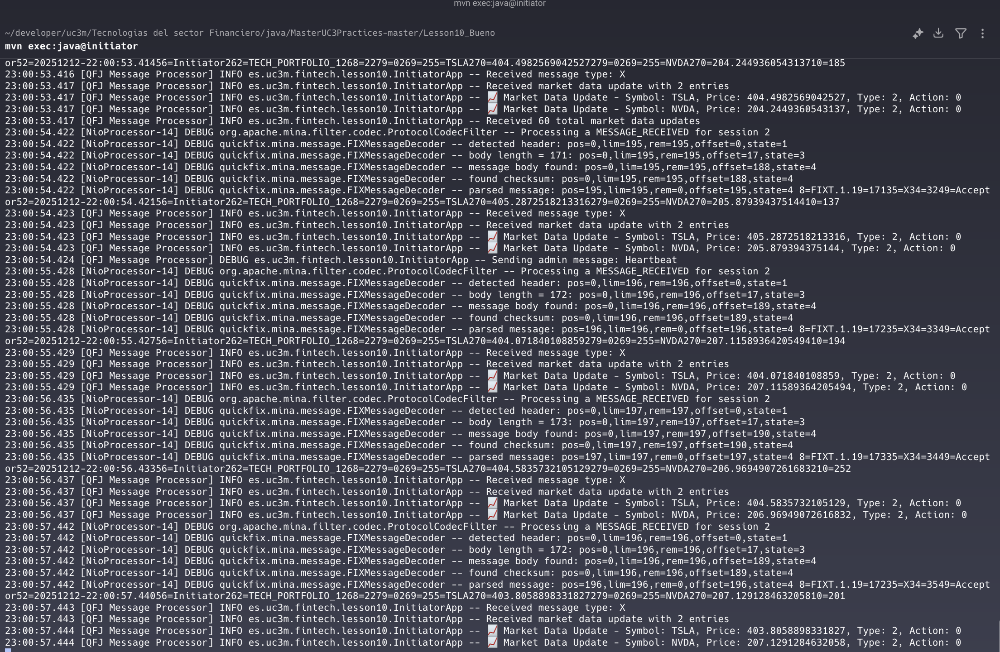

# FIX Protocol Market Data Client

A **Java implementation of a FIX 5.0SP2 market data subscription flow** built on top of [QuickFIX/J](https://www.quickfixj.org/). The project models the canonical interaction between a **Market Data Provider** (Acceptor) and a **Market Data Subscriber** (Initiator) — the same pattern used by exchanges, OMS/EMS platforms and price-feed gateways across capital markets.

The Initiator subscribes to a basket of equities (TSLA and NVDA) via `MarketDataRequest` and consumes a continuous stream of `MarketDataIncrementalRefresh` messages produced by the Acceptor — including session lifecycle (Logon, Heartbeat, Logout), persisted message stores, and full FIX wire-level logs.

---

## What this project does

- **FIX 5.0SP2 session over FIXT.1.1** between two QuickFIX/J endpoints on `localhost:10000`.
- **Acceptor (server)** — Hosts a `MarketDataService` that drives a deterministic random-walk price stream (TSLA from 400.0, NVDA from 200.0) and pushes one `MarketDataIncrementalRefresh` per second per symbol over the active session.
- **Initiator (client)** — On `Logon`, sends a `MarketDataRequest` with `SubscriptionRequestType=1` (Snapshot + Updates), `MarketDepth=0` (Full Book), one MD entry type (`Trade`) and two `NoRelatedSym` groups (TSLA, NVDA). Cracks each incoming refresh and logs `Symbol`, `MDEntryPx`, `MDEntryType`, `MDUpdateAction`.
- **Session machinery** — File-backed `MessageStoreFactory` and `LogFactory` produce the canonical QuickFIX/J artefacts: `*.messages.log` (FIX wire format), `*.event.log`, sequence number files. These are the same logs that get replayed during reconciliation in production trading systems.

---

## Tech stack

| Area | Choice |
|------|--------|
| Language | Java 21 |
| Build | Maven |
| FIX engine | QuickFIX/J 2.3.2 |
| FIX dialect | FIXT.1.1 transport, FIX 5.0SP2 application |
| Logging | SLF4J + Logback |
| Tests | JUnit 5 |

---

## Quick start

**Requirements:** Java 21 (LTS) or newer, Maven 3.9+.

From the project root, in two terminals:

```bash
# Terminal 1 — Acceptor (start first; listens on 127.0.0.1:10000)
mvn exec:java@acceptor

# Terminal 2 — Initiator
mvn exec:java@initiator
```

The Acceptor must be running before the Initiator connects. Once `Logon` completes, the Initiator sends `MarketDataRequest TECH_PORTFOLIO_1` and the Acceptor begins streaming price updates. To stop, `Ctrl+C` either side; both `acceptor.cfg` and `initiator.cfg` use `ResetOnLogout=Y` so sequence numbers reset cleanly between runs.

If port 10000 is in use locally, change `SocketAcceptPort` / `SocketConnectPort` in both config files.

---

## Project layout

```
src/main/java/es/uc3m/fintech/lesson10/
├── AcceptorRunner.java     # Bootstraps SocketAcceptor + SessionSettings from acceptor.cfg
├── AcceptorApp.java        # Application/MessageCracker — handles MarketDataRequest
├── InitiatorRunner.java    # Bootstraps SocketInitiator + SessionSettings from initiator.cfg
├── InitiatorApp.java       # Application/MessageCracker — sends MarketDataRequest, consumes refreshes
└── MarketDataService.java  # Synthetic price generator + publisher thread

src/main/resources/
├── acceptor.cfg            # FIXT.1.1 / FIX 5.0SP2, SenderCompID=Acceptor, listens on 10000
└── initiator.cfg           # FIXT.1.1 / FIX 5.0SP2, SenderCompID=Initiator, HeartBtInt=30s
```

---

## Session lifecycle and FIX message flow

The Acceptor is the **server-side** of the session: it listens, replies to `Logon`, drives `Heartbeat`s, and routes `MarketDataRequest` to the `MarketDataService`. The Initiator is the **client-side**: it dials in, sends one `MarketDataRequest`, and consumes the resulting `MarketDataIncrementalRefresh` stream.

```
  Initiator (Client)                 Acceptor (Server)
        |                                  |
        |  ──────  Logon (35=A)  ────────► |
        |  ◄──────  Logon (35=A)  ──────── |
        |                                  |
        |  ─── MarketDataRequest (35=V) ─► |   MDReqID=TECH_PORTFOLIO_1
        |                                  |   Symbols=[TSLA, NVDA]
        |                                  |
        |  ◄── IncrementalRefresh (35=X) ─ |   Repeats every second
        |  ◄── IncrementalRefresh (35=X) ─ |
        |  ◄── IncrementalRefresh (35=X) ─ |
        |                                  |
        |  ◄────  Heartbeat (35=0)  ────►  |   Every HeartBtInt=30s
        |                                  |
        |  ─────  Logout (35=5)  ────────► |
        |  ◄─────  Logout (35=5)  ──────── |
```

A real fragment from `logs/FIXT.1.1-Acceptor-Initiator.messages.log` after a successful run:

```
8=FIXT.1.1|9=85|35=A|34=1|49=Initiator|...|56=Acceptor|98=0|108=30|141=Y|1137=9|10=156   ← Logon
8=FIXT.1.1|9=85|35=A|34=1|49=Acceptor|...|56=Initiator|98=0|108=30|141=Y|1137=9|10=165   ← Logon ack
8=FIXT.1.1|9=111|35=V|34=2|49=Initiator|...|146=2|262=TECH_PORTFOLIO_1|263=1|264=0|...   ← MarketDataRequest
8=FIXT.1.1|9=60|35=0|34=3|49=Initiator|...|10=011                                        ← Heartbeat
8=FIXT.1.1|9=60|35=0|34=3|49=Acceptor|...|10=016                                         ← Heartbeat
```

Tag-by-tag breakdown of the subscription request:

| Tag | Field | Value | Meaning |
|----:|-------|-------|---------|
| 35 | MsgType | `V` | MarketDataRequest |
| 262 | MDReqID | `TECH_PORTFOLIO_1` | Subscription correlation id |
| 263 | SubscriptionRequestType | `1` | Snapshot + Updates |
| 264 | MarketDepth | `0` | Full book |
| 267 | NoMDEntryTypes | `1` | One entry type follows |
| 269 | MDEntryType | `2` | Trade |
| 146 | NoRelatedSym | `2` | Two symbols requested |
| 55 | Symbol | `TSLA`, `NVDA` | Requested instruments |

---

## Screenshots

### Part 1 — Session establishment (Logon, Heartbeat)

| Acceptor — Listening, accepts Logon | Initiator — Connects, exchanges Heartbeats |
| :--- | :--- |
|  |  |

### Part 2 — Market data subscription and streaming

| Acceptor — Pushes MarketDataIncrementalRefresh | Initiator — Cracks refreshes, logs prices |
| :--- | :--- |
|  |  |

The `logs/` folder contains the raw QuickFIX/J `*.messages.log` from a recorded run for both sides of the session, so the FIX wire format can be inspected directly without re-running the system.

---

## Design notes

- **Why FIXT.1.1 + FIX 5.0SP2.** FIX 5.0 deliberately split the session layer (FIXT) from the application layer (FIX 5.0SP2). It is the dialect targeted by most modern equities and derivatives venues. QuickFIX/J needs both `FIXT11.xml` and `FIX50SP2.xml` data dictionaries, which are bundled with `quickfixj-all`.
- **Deterministic price stream.** `MarketDataService` seeds its `Random` with a fixed seed (`42`). A given run of the Acceptor produces the same TSLA/NVDA tick sequence every time, which makes the screenshots and logs in this repo fully reproducible — useful when comparing FIX captures across versions.
- **Subscription model.** `SubscriptionRequestType=1` means the Acceptor must send an initial snapshot followed by incremental updates. This implementation simplifies that to "incremental refresh only" — adequate for an end-to-end demo but worth flagging when comparing against production gateways that respect the snapshot/update split.
- **Threading.** Each subscription spawns a dedicated `PriceUpdateThread-<MDReqID>` on the Acceptor side. The thread is interrupt-aware and stops cleanly on session loss, mirroring how production market data adaptors decouple price generation from session I/O.
- **Persistent session state.** `FileStoreFactory` writes sequence numbers and message bodies under `logs/` per session. Combined with `ResetOnLogout=Y` / `ResetOnDisconnect=Y` in both configs, the demo restarts cleanly without manual cleanup.

---

## Reference

The implementation follows the exercises and message specifications from **Lección 10 — Protocolos de Mercado** (FIX / QuickFIX/J) of the Master in Financial Sector Technologies (UC3M). The original practice document is preserved alongside the repository for traceability.
