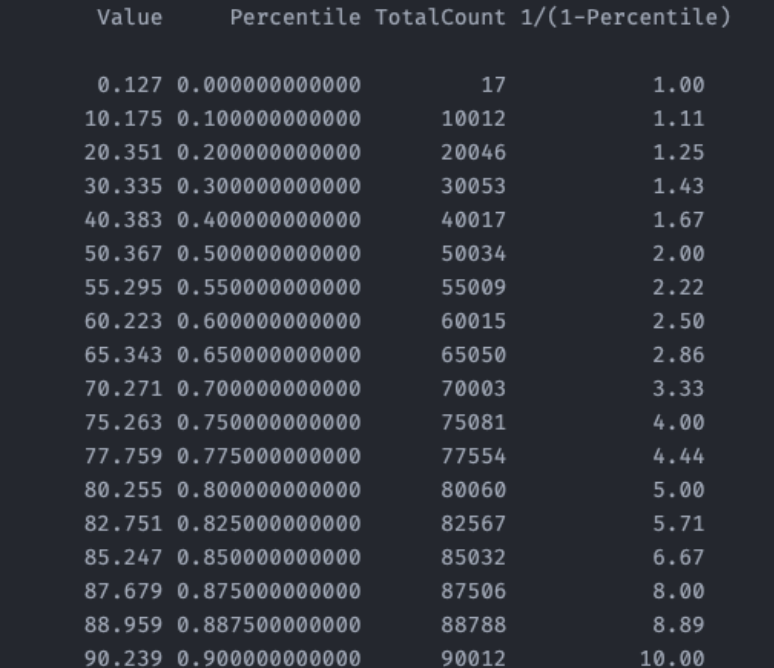
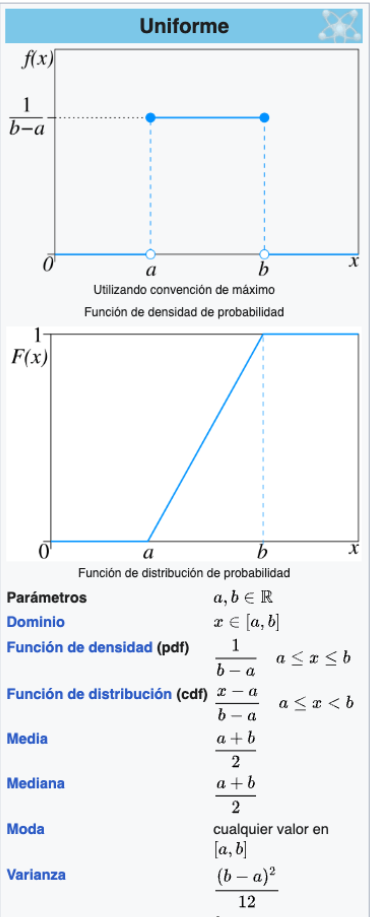
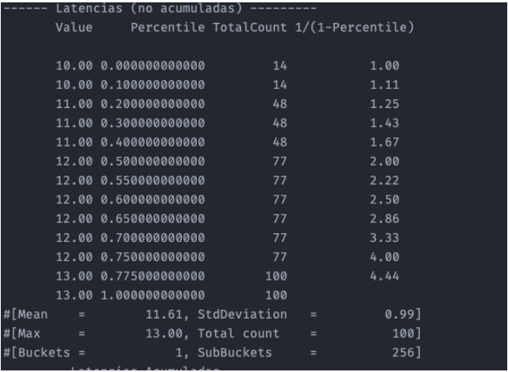
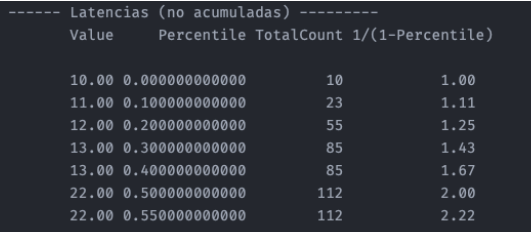
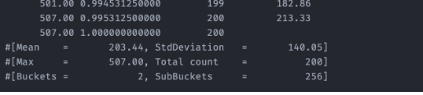
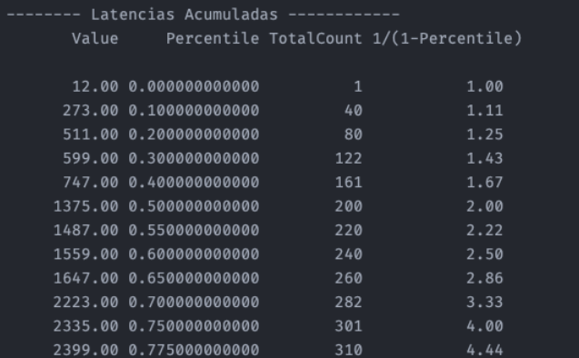

# ⚡ High-Performance Concurrency: Latency & Jitter Analysis

**Domain:** Low-Latency Systems, Fintech Engineering.
**Stack:** Java, HdrHistogram, Multi-threading, Maven.
**Context:** Advanced Academic Research (Master in Fintech Engineering).

> *An engineering analysis focusing on the difference between "Service Time" (Pure Latency) and "Response Time" (Accumulated Latency) under high-concurrency loads.*

---

## 🎯 Executive Summary
In high-frequency trading and real-time systems, averages are misleading. This project benchmarks **latency tail distributions (P99, P99.99)** to demonstrate how slight congestions in thread pools lead to exponential delays in execution.

---

## ⚙️ Architecture & Methodology
To ensure benchmark accuracy and avoid the "Coordinated Omission" problem, the simulation engine relies on two distinct strategies for load generation and measurement.

### 1. Nanosecond-Precision Jitter Simulation (`PracticeLatency1`)
Standard `Thread.sleep()` in Java relies on the OS scheduler, which introduces unpredictable noise (jitter) incompatible with nanosecond-level benchmarking.
* **Strategy:** We implemented a **Busy-Wait Simulator** (`SyncOpSimulRndPark`).
* **Mechanism:** Instead of yielding the CPU, the thread performs a spin-loop until the target time is reached. This simulates pure CPU-bound work and allows for precise Uniform Distribution generation.

```java
// Simulating pure CPU work without OS Scheduler interference
long startTime = System.nanoTime();
while(System.nanoTime() - startTime < newParkTime);
```

### 2. Modeling Resource Contention (PracticeLatency2)
To simulate a real-world bottleneck (e.g., a database connection pool or a locked critical section), we used a Shared Monitor Pattern.

The Bottleneck: A single SyncOpSimulSleep instance is shared across all worker threads.

The Lock: The executeOp() method is marked as synchronized. This forces serial execution, turning a parallel workload into a sequential queue effectively.

```java
// Forcing thread contention via Monitor Lock
public synchronized void executeOp() {
    try { Thread.sleep(sleepTime); } 
    catch (InterruptedException e) { ... }
}
````

### 3. Measuring "Accumulated Latency"
In high-concurrency scenarios, measuring how long a task takes (Service Time) is insufficient. We calculate Response Time by tracking the drift between the expected start time and the actual execution time.

Formula: Accumulated Latency = Service Latency + (ActualStartTime - ExpectedStartTime)

---

## 📊 Module 1: Synchronous Latency Baselines
**Objective:** Establish a baseline for operation costs using `HdrHistogram` to capture nanosecond-precision timing without the "Coordinated Omission" problem.

### Key Findings
* Validated **Uniform Distribution** behavior in a controlled environment.
* **Benchmark Results:**
    * Mean Latency: ~50µs.
    * Max Jitter: ~149µs (due to OS scheduling/GC pauses).
    * Statistical convergence with theoretical variance $\sqrt{(b-a)^2/12}$.

<br>


<br>

<br>
*(Theoretical vs Real-world distribution analysis)*
<br>


---

## 🚀 Module 2: Concurrency & Resource Contention
**Objective:** Simulate a **Producer-Consumer** bottleneck. We compare a system under healthy load vs. saturated load to visualize the "Hockey Stick" latency curve.

### Scenarios Analyzed

### A. Healthy State (1 Thread, 50 ops/s)
System is operating within capacity ($\lambda < \mu$).
* **Result:** Zero queue accumulation. Service time equals Response time.

<br>


<br>

---

<br>

### B. The "Death Spiral" (Saturation)
When request rate exceeds service rate (Simulating 500 ops/s on a 10ms task).
* **Impact:** While *processing time* remains stable (~12ms), the **Queue Time** explodes.
* **Metric:** Latency Accumulation grows linearly with time, rendering the system unresponsive.

<br>

**Service Latencies (Stable):**
<br>


**Accumulated Latencies (Queue Explosion):**
<br>


<br>

---

<br>

### C. Multi-Threaded Contention (Context Switching)
Scaling to multiple threads sharing a synchronized resource to analyze lock contention overhead.

**1. Scenario: 2 Threads**
`MAX_EXPECTED_EXECUTIONS_PER_SECOND = 50`

<br>


<br>


> **Analysis:** The mean latency (**22.83ms**) already exceeds the arrival interval (**20ms**). Therefore, the system is mathematically unstable, and accumulated latencies are bound to increase.

<br>


<br>


> **Result:** Mean accumulated latency reached **283ms**.

<br>

**2. Scenario: 4 Threads**
Scaling directly to 4 Threads.
`MAX_EXPECTED_EXECUTIONS_PER_SECOND = 50`

<br>


> **Analysis:** Compared to the 2-thread scenario, the mean has risen considerably. Likewise, the P90 value and the accumulated variance have spiked disproportionately.

<br>


<br>


> **Critical Conclusion:**
> * Mean Accumulated Latency: **1380.20ms**.
> * As observed, mean service latencies increased by less than 2x (due to lock overhead), but **accumulated latencies nearly tripled** compared to the 2-thread scenario.
> * **Takeaway:** To keep accumulated latencies low in this 4-thread configuration, `MAX_EXPECTED_EXECUTIONS_PER_SECOND` must be significantly reduced below 50 to account for coordination overhead.

---

## 🧠 Engineering Takeaways
1. **Never trust the Average:** The mean latency remained acceptable even when the system was effectively down for users (high P99).
2. **Coordinated Omission:** Standard benchmarks often miss the time requests spend "waiting" to start. Tracking *Accumulated Latency* is critical for SLA compliance in Fintech.
3. **Capacity Planning:** For strict latency requirements (e.g., market data feeds), the `MAX_EXPECTED_EXECUTIONS` must be kept significantly below the theoretical throughput to absorb Jitter.