# Latency & Jitter Analysis under High-Concurrency Load

A focused engineering study on the difference between **service time** (the time a request takes once it has started executing) and **response time** (the time a request takes from the moment it *should have* started, including queueing and scheduler drift). The two are easy to confuse and very expensive to confuse — in a trading context, the system that *looks* fine on mean service time can be effectively unresponsive under load if response time is exploding.

The benchmarks here use `HdrHistogram` to capture nanosecond-precision distributions, side-step the OS scheduler with a busy-wait simulator, and walk through what happens to a queue when arrival rate exceeds service rate (the canonical *coordinated omission* problem).

---

## Why this matters

In high-frequency trading and any real-time path that touches market data, the **mean** latency is the single least informative number you can publish. Tail latencies (P99, P99.9, P99.99) drive SLA compliance; small congestions in shared resources turn into exponential delays once arrival rate clips service rate. The two modules in this project make that mechanic visible:

- **Module 1** establishes a clean baseline with controlled, nanosecond-precision jitter. It validates that the simulator behaves like a uniform distribution should.
- **Module 2** pushes the system past saturation point with a single shared synchronised resource and several worker threads. The mean stays deceptively flat; accumulated latency goes off the charts.

---

## Tech stack

| Area | Choice |
|------|--------|
| Language | Java |
| Build | Maven |
| Metrics | HdrHistogram |
| Concurrency | Thread pools, monitor locks (`synchronized`), busy-wait simulators |

---

## Methodology

Two design choices keep the benchmarks honest under high concurrency.

### 1. Nanosecond-precision jitter via busy-wait

`Thread.sleep()` defers to the OS scheduler, which introduces uncontrolled jitter — fine for slow simulations, useless for nanosecond-level work. The simulator uses a busy-wait loop instead, which represents pure CPU-bound work and makes the distribution shape match its theoretical model:

```java
long startTime = System.nanoTime();
while (System.nanoTime() - startTime < newParkTime) { /* spin */ }
```

This is the same pattern Aeron's `BusySpinIdleStrategy` and any low-latency executor uses to avoid scheduler interference.

### 2. Resource contention via a shared synchronised monitor

To model a real bottleneck — a database connection pool, a critical section, a single-writer market-data buffer — every worker thread shares a single `SyncOpSimulSleep` instance whose `executeOp()` is `synchronized`. A naïvely-parallel workload becomes a strictly serial queue:

```java
public synchronized void executeOp() {
    try { Thread.sleep(sleepTime); }
    catch (InterruptedException e) { /* ... */ }
}
```

### 3. Capturing accumulated latency

Service time alone is insufficient. The simulator also captures **accumulated latency**, which tracks the drift between the time at which a task *should* have started and the time it actually did:

```
Accumulated latency = Service latency + (ActualStartTime − ExpectedStartTime)
```

This is the metric that survives coordinated omission. If the publisher falls behind because a previous request blocked, that delay shows up here even when `service latency` looks unchanged.

---

## Module 1 — Synchronous latency baselines

**Objective:** establish a clean baseline with `HdrHistogram` and confirm that the simulator behaves like a uniform distribution under controlled load.

### Findings

- Validated **uniform-distribution** behaviour against the theoretical variance $\sqrt{(b-a)^2/12}$.
- Mean latency: **~50 µs**.
- Maximum jitter: **~149 µs** (driven by OS scheduling slots and GC pauses).

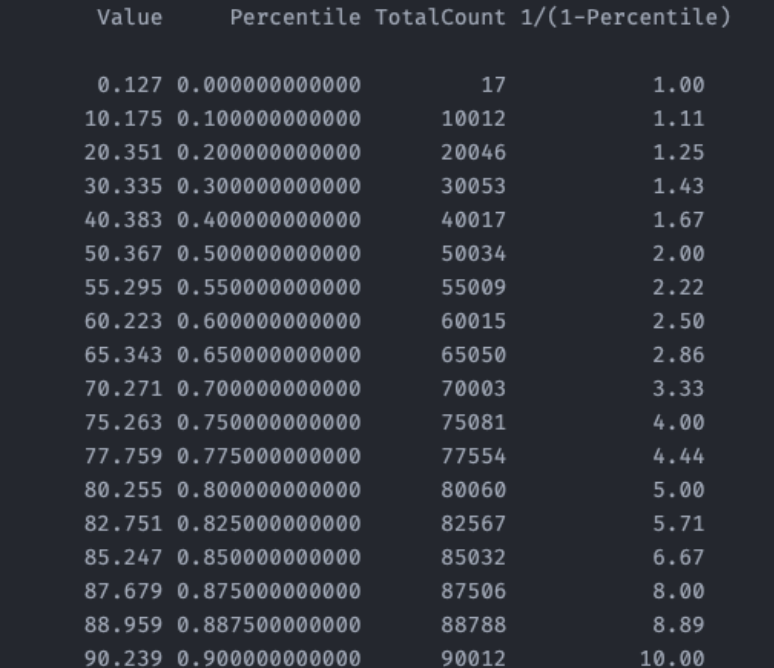

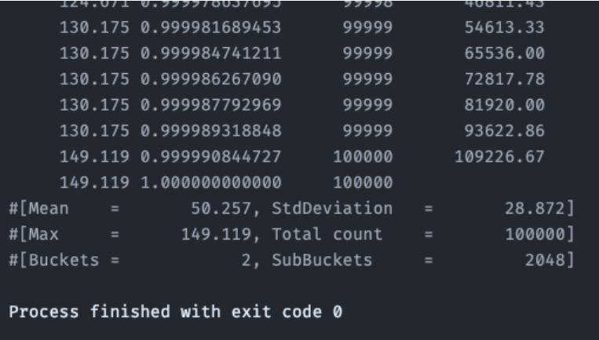

*Theoretical vs measured distribution shape; the agreement validates the busy-wait approach.*

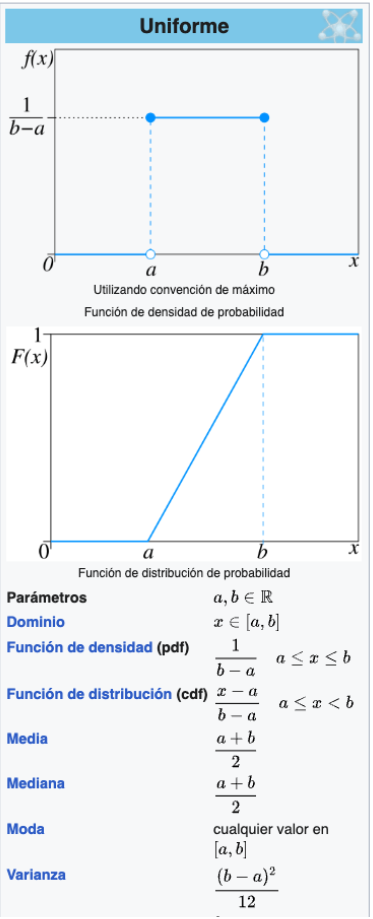

---

## Module 2 — Concurrency and resource contention

**Objective:** simulate a producer-consumer bottleneck under several arrival rates and several worker counts. Compare the system in a healthy regime against the saturated regime, and show the "hockey-stick" curve at the transition.

### A. Healthy state (1 thread, 50 ops/s)

System runs within capacity (λ < µ). Zero queue accumulation; service time and response time are indistinguishable.

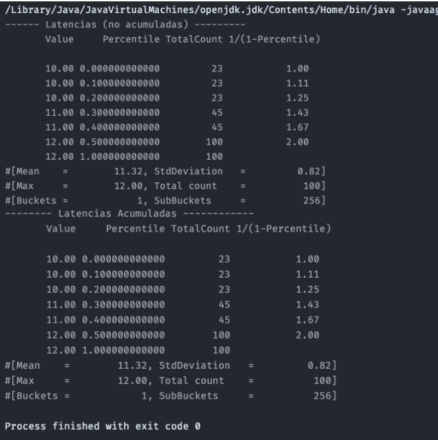

### B. Saturation — the death spiral (1 thread, 500 ops/s, 10 ms task)

Arrival rate exceeds service rate. The processing time itself stays stable around **~12 ms**, but queue time grows linearly with elapsed simulation time. By the time the queue hits steady-state nonsense, the system is unresponsive to any user — even though the *per-request* time looks unchanged.

**Service latencies (stable):**

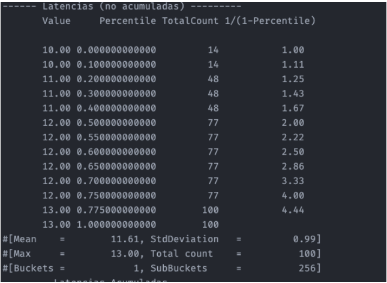

**Accumulated latencies (queue explodes):**

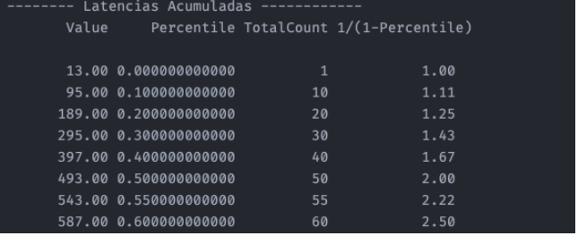

### C. Multi-threaded contention

Scaling to multiple worker threads sharing one synchronised resource. The interesting behaviour is not that latency rises — that's expected — but that *accumulated* latency rises **disproportionately faster** than service latency, because every thread's contribution lands on the same lock queue.

#### Two threads, MAX_EXPECTED_EXECUTIONS_PER_SECOND = 50

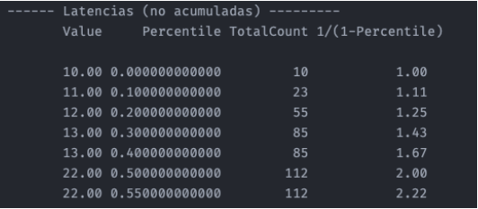

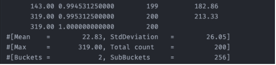

> Mean service latency (**22.83 ms**) already exceeds the 20 ms arrival interval at 50 ops/s. The system is mathematically unstable from the first second; accumulated latency is bound to grow.

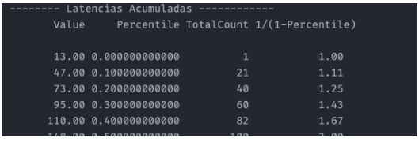

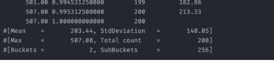

> Mean accumulated latency reaches **283 ms**.

#### Four threads, MAX_EXPECTED_EXECUTIONS_PER_SECOND = 50

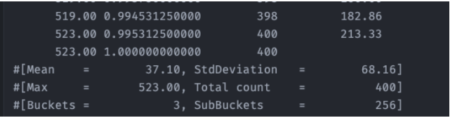

> Compared with two threads, mean rises noticeably; P90 and accumulated variance spike disproportionately.

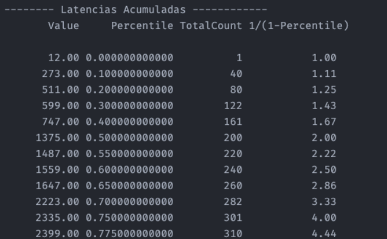

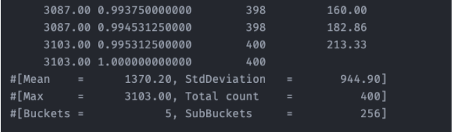

> **Mean accumulated latency: 1,380.20 ms.** Service latency increased by less than 2× under the lock-overhead penalty, but accumulated latency nearly **tripled** compared to the two-thread case. Practical takeaway: to keep accumulated latency low at four threads, `MAX_EXPECTED_EXECUTIONS_PER_SECOND` must drop well below 50 to absorb the coordination overhead.

---

## Engineering takeaways

1. **Never trust the mean.** A system can look healthy on average and be down for users at the same time, simply because the tail dominates the experience.
2. **Coordinated omission is real.** Standard benchmarks routinely under-measure how long requests spend *waiting to start*. Tracking accumulated latency, not just service time, is the difference between SLA compliance and SLA violation hidden in plain sight.
3. **Capacity planning is a tail problem.** For strict latency requirements (market-data feeds, order entry), `MAX_EXPECTED_EXECUTIONS` must sit comfortably below the theoretical throughput so the system has headroom to absorb jitter, GC, scheduler drift and lock overhead.

---

## Reference

Implementation of the exercises and analysis from **Lección 1 — Medición de Latencias** of the Master in Financial Sector Technologies (UC3M), focused on the instrumentation discipline that any production performance evaluation in a trading context relies on.
