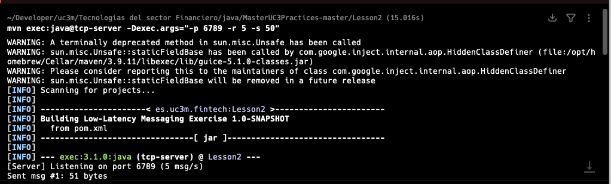
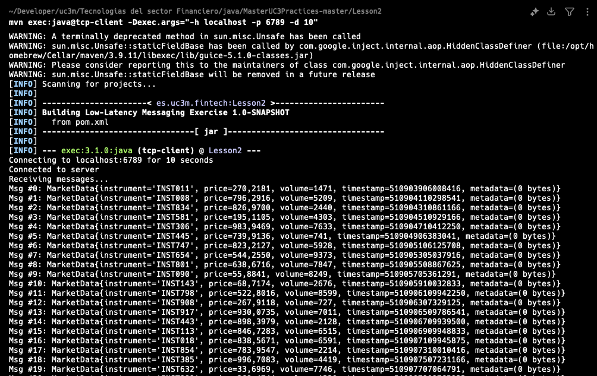
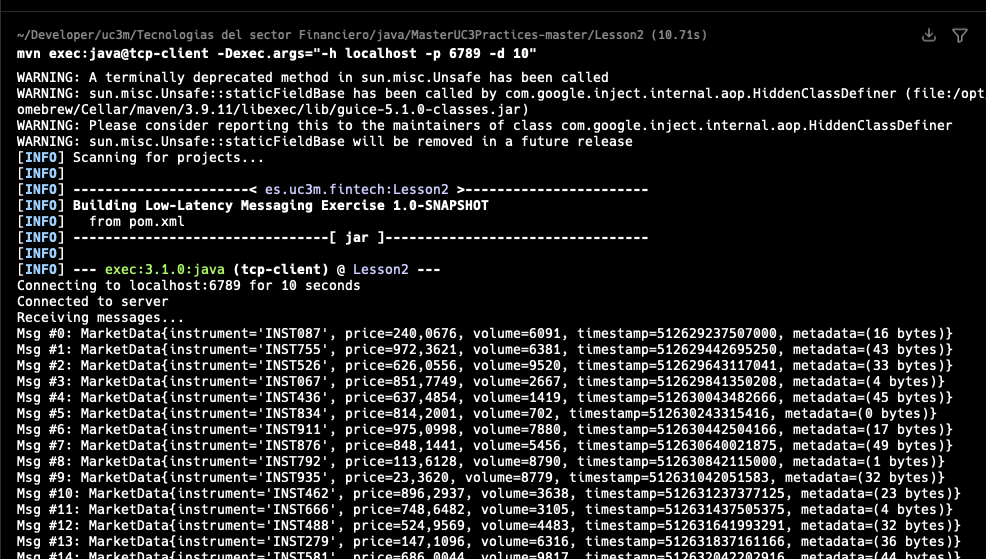
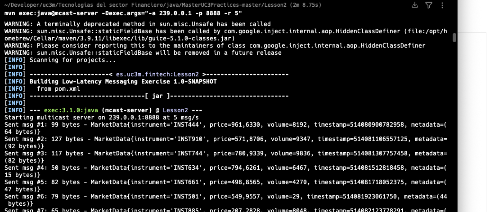
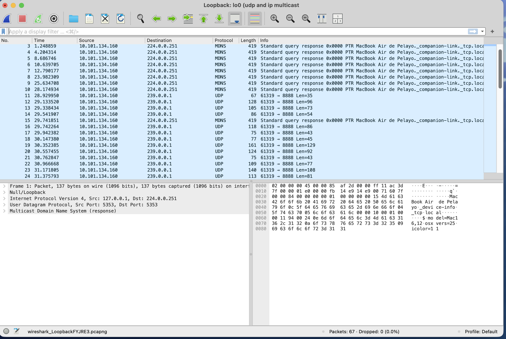

# Low Latency Market Data Messenger

A **Java-based market data messaging system** built with custom binary protocols over TCP and UDP Multicast. The project explores low-latency communication patterns used in trading and market data distribution, from socket-level I/O to protocol design and network verification with Wireshark.

---

## What this project does

- **TCP streaming** — Reliable point-to-point market data feed with support for both fixed-size and variable-size messages (length-prefixed framing).
- **UDP Multicast** — One-to-many broadcast feed for high-fanout distribution without per-client connections.
- **Binary protocol** — Compact `MarketMessage` format (instrument, price, volume, timestamp, optional metadata) with big-endian serialization via `ByteBuffer`.
- **Traffic verification** — PCAP captures and Wireshark screenshots showing real TCP and multicast traffic for protocol validation.

Designed to run and inspect locally: start server and client(s), capture traffic, and inspect frames in Wireshark.

---

## Tech stack

| Area | Choice |
|------|--------|
| Language | Java 21+ |
| Build | Maven |
| Protocol | Custom binary (big-endian) |
| Transport | TCP (point-to-point), UDP Multicast |
| Analysis | Wireshark, PCAP/PCAPNG |

---

## Quick start

**Requirements:** Java 21 (LTS) or newer, Maven 3.9+.

Clone the repo and from the project root:

```bash
# TCP: start server first, then client (other terminal)
mvn exec:java@tcp-server
mvn exec:java@tcp-client

# Multicast: start server first, then one or more clients
mvn exec:java@mcast-server
mvn exec:java@mcast-client
```

Default TCP port: `6789`. Multicast group and port are set in the respective main classes.

---

## Project layout

```
src/main/java/es/uc3m/fintech/lesson2/
├── message/
│   └── MarketMessage.java    # Binary serialization (instrument, price, volume, timestamp, metadata)
├── tcp/
│   ├── TCPServer.java        # TCP server: fixed & variable-size streaming
│   └── TCPClient.java        # TCP client: framing and deserialization
├── mcast/
│   ├── McastServer.java      # Multicast sender (UDP)
│   └── McastClient.java      # Multicast receiver (join group, receive datagrams)
└── util/
    ├── NetIO.java            # readFully, framing helpers
    └── PerformanceMetrics.java
```

- **TCP:** Stream-oriented; variable-size messages use a 4-byte length header before each payload.
- **Multicast:** Datagram-based; each UDP packet carries one serialized message.

---

## Screenshots

### TCP — Server and client (fixed and variable size)

| Server (fixed size) | Server (variable size) |
|---------------------|-------------------------|
|  |  |

| Client (fixed size) | Client (variable size) |
|---------------------|-------------------------|
|  |  |

### Multicast — Server and client

| Multicast Server | Multicast Client |
|------------------|------------------|
|  |  |

### Wireshark — Traffic verification

| TCP (port 6789) | UDP Multicast |
|-----------------|----------------|
|  |  |

Captures used for these screenshots are under `captures/` (e.g. `tcp_6789_capture.pcapng`, `multicast.pcapng`). Open them in Wireshark to inspect the binary protocol on the wire.

---

## Design notes

- **Framing:** TCP uses a 4-byte big-endian length prefix for variable-size messages so the receiver can read exact payload size before deserializing.
- **Multicast:** No connection state; clients join a multicast group and receive datagrams; the app assumes one message per datagram.
- **Serialization:** `MarketMessage` uses fixed offsets and big-endian `ByteBuffer` for portability and predictable wire format, suitable for debugging in Wireshark.

---

## Reference

The implementation follows the exercises and protocol description from **Lección 2 – Mensajería de Baja Latencia** (see `Leccion2-Practica.pdf` in this repo for the original practice document).
