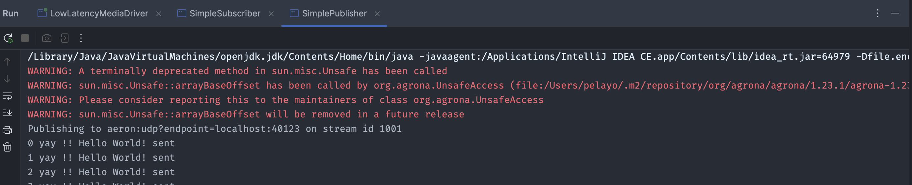
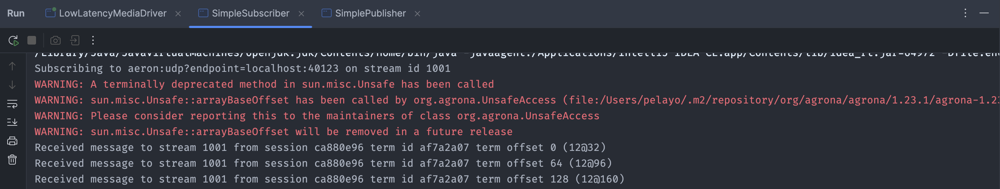
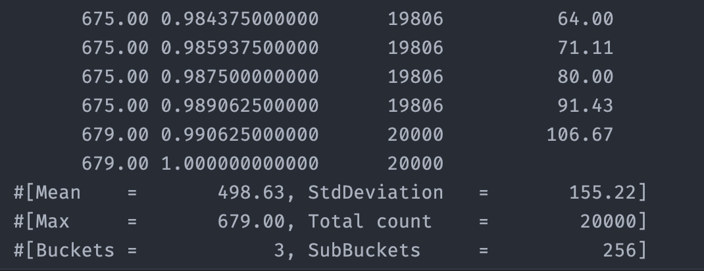

# Low-Latency Messaging Benchmarks with Aeron (Java)

End-to-end design and evaluation of a **low-latency messaging pipeline** using [Aeron](https://github.com/real-logic/aeron). The project implements **publish/subscribe** flows over **unicast**, **multicast** and **IPC** transports, and benchmarks their **latency distributions** and **accumulated latency** under increasing throughput — the same trade-off space that drives transport selection for market-data distribution and electronic trading systems.

The aim is not just to make the messaging path work, but to surface the **performance trade-offs** that matter in production fintech infrastructure: latency, throughput, back-pressure, and message loss. The configuration of choice in a trading deployment is rarely the one with the lowest mean latency — it is the one that sustains acceptable latency *without dropping messages* under stress.

---

## Tech stack

| Area | Choice |
|------|--------|
| Language | Java (Maven project) |
| Messaging | [Aeron](https://github.com/real-logic/aeron) — Publish/Subscribe over UDP unicast, UDP multicast and IPC |
| Metrics | HdrHistogram (`ConcurrentHistogram`) |
| Patterns | Non-blocking `offer`, `FragmentHandler`-based polling, explicit back-pressure handling |

---

## Architecture

### Media drivers

Two driver configurations are provided under `driver/`. They differ in the trade-off between latency and CPU consumption:

- **`LowLatencyMediaDriver`**
  - Dedicated threading model (`ThreadingMode.DEDICATED`).
  - Aggressive idle strategies (`BusySpinIdleStrategy`, `NoOpIdleStrategy`) that keep cores spinning instead of sleeping.
  - Optimised for **minimum latency**, at the cost of multiple cores running near 100 %.

- **`BackOffMediaDriver`**
  - Shared threading (`ThreadingMode.SHARED`).
  - `BackoffIdleStrategy` to release CPU when no messages are pending.
  - Suitable when **resource efficiency** dominates the requirement set.

The choice mirrors a real infrastructure decision in trading: *do we dedicate cores to market data, or share cores and accept extra jitter?*

### Messaging components

Common configuration lives in `Constants`. It controls scenario throughput, message count and the active transport:

```java
static final int  MAX_EXECUTIONS_PER_SECOND   = 100_000;
static final long EXPECTED_TIME_BETWEEN_CALLS = TimeUnit.SECONDS.toMillis(1) / MAX_EXECUTIONS_PER_SECOND;
static final int  NUM_MESSAGES                = 200_000;

// Available channels:
//   "aeron:ipc"
//   "aeron:udp?endpoint=224.0.1.1:40456"   (multicast)
//   "aeron:udp?endpoint=localhost:40456"   (unicast)
static final String CHANNEL   = "aeron:ipc";
static final int    STREAM_ID = 1001;
```

**Hello-Aeron flow.** `SimplePublisher` and `SimpleSubscriber` walk through the canonical Aeron lifecycle: start the Media Driver, connect via `Aeron.connect(ctx)`, attach a `Publication` / `Subscription` to `(CHANNEL, STREAM_ID)`, push messages with non-blocking `offer` and pull them with a `FragmentHandler`. The publisher logs every back-pressure outcome explicitly (`BACK_PRESSURED`, `NOT_CONNECTED`, `ADMIN_ACTION`, `CLOSED`), which is the first sanity check on the wire.

**Latency-aware flow.** `LatencyPublisher` emits timestamped messages at a precise rate. Each frame carries the publisher's *scheduling delay* (how late the publisher is relative to its ideal send time) and a *send timestamp*:

```java
long nextCallTime = System.currentTimeMillis();
for (int i = 0; i < Constants.NUM_MESSAGES; i++) {
    while (System.currentTimeMillis() < nextCallTime) { /* busy wait */ }

    long delay    = System.currentTimeMillis() - nextCallTime;
    long currTime = System.currentTimeMillis();
    String message = delay + "|" + currTime;
    ...
    long result = publication.offer(buffer, 0, messageBytes.length);
    ...
    nextCallTime += Constants.EXPECTED_TIME_BETWEEN_CALLS;
}
```

`LatencySubscriber` parses both fields and records two distributions on a `ConcurrentHistogram`:

```java
String[] parts   = rcvMessage.split("\\|");
long delayMs     = Long.parseLong(parts[0]);
long sendTimeMs  = Long.parseLong(parts[1]);

long nowMs                = System.currentTimeMillis();
long latencyMs            = nowMs - sendTimeMs;
long accumulatedLatencyMs = latencyMs + delayMs;

histogram.recordValue(latencyMs);
histogramAcc.recordValue(accumulatedLatencyMs);
```

- **Latency:** per-message wall-clock, publisher to subscriber.
- **Accumulated latency:** latency *plus* the publisher's own scheduling delay.

The split is deliberate. Under load, two systems can show identical mean latency while one of them is silently letting the publisher fall behind its target rate — *accumulated latency* is what surfaces that. This is the same instrumentation pattern production trading gateways use to reason about end-to-end performance.

---

## Hello-Aeron screenshots

| Subscriber node (consumer) | Publisher node (producer) |
| :--- | :--- |
|  |  |
| *Receiving messages from stream 1001* | *Broadcasting "Hello World!" to localhost:40123* |

| Sample latency distribution from the histogram output |
| :--- |
|  |

Additional screenshots (per-battery summary tables, console captures, percentile plots) live under `screenshots/`.

---

## Benchmark scenarios

Three benchmark batteries are configured by editing `Constants` and re-running publisher/subscriber:

### Battery 1 — Baseline load

- **Messages:** 20,000
- **Rate:** 1,000 msg/s
- **Transports:** unicast (`aeron:udp?endpoint=localhost:40456`), multicast (`aeron:udp?endpoint=224.0.1.1:40456`), IPC (`aeron:ipc`).
- **Goal:** establish a clean baseline with sub-second latencies, minimal queueing and no loss.

| Channel | Type | Mean (ms) | Std-dev | Max (ms) | Total count | Rate (msg/s) | Messages |
| :--- | :--- | ---: | ---: | ---: | ---: | ---: | ---: |
| **Unicast** | Latency | 0.05 | 0.82 | 29.00 | 20,000 | 1,000 | 20,000 |
| **Unicast** | Accumulated | 0.05 | 0.84 | 29.00 | 20,000 | 1,000 | 20,000 |
| **Multicast** | Latency | 0.13 | 1.40 | 37.00 | 20,000 | 1,000 | 20,000 |
| **Multicast** | Accumulated | 0.14 | 1.49 | 37.00 | 20,000 | 1,000 | 20,000 |
| **IPC** | Latency | 0.02 | 0.40 | 19.00 | 20,000 | 1,000 | 20,000 |
| **IPC** | Accumulated | 0.02 | 0.40 | 19.00 | 20,000 | 1,000 | 20,000 |

> Ordering by speed: **IPC fastest, then unicast, then multicast.** Multicast carries extra protocol overhead that does not pay back when there is a single subscriber.

### Battery 2 — High load

- **Messages:** 20,000
- **Rate:** 50,000 msg/s
- **Transports:** same three.
- **Goal:** observe queue build-up, the divergence between latency and accumulated latency, and which transport copes best under stress.

| Channel | Type | Mean (ms) | Std-dev | Max (ms) | Total count | Rate (msg/s) | Messages |
| :--- | :--- | ---: | ---: | ---: | ---: | ---: | ---: |
| **Unicast** | Latency | 424.00 | 195.18 | 739.00 | 20,000 | 50,000 | 20,000 |
| **Unicast** | Accumulated | 548.37 | 243.79 | 923.00 | 20,000 | 50,000 | 20,000 |
| **Multicast** | Latency | 498.63 | 155.22 | 679.00 | 20,000 | 50,000 | 20,000 |
| **Multicast** | Accumulated | 603.23 | 204.55 | 871.00 | 20,000 | 50,000 | 20,000 |
| **IPC** | Latency | 296.15 | 149.64 | 571.00 | 20,000 | 50,000 | 20,000 |
| **IPC** | Accumulated | 358.89 | 174.50 | 675.00 | 20,000 | 50,000 | 20,000 |

> Across all transports, accumulated latency is materially larger than raw latency — that gap is the queueing effect that mean numbers alone hide. IPC remains the most robust in latency, followed by unicast and then multicast.

### Battery 3 — Stress / reliability

- **Messages:** 200,000
- **Rate:** 100,000 msg/s
- **Transports:** same three.
- **Goal:** push the system past its sustainable rate. Compare how each transport copes — and crucially, **whether it drops messages**.

| Channel | Type | Mean (ms) | Std-dev | Max (ms) | Total count | Rate (msg/s) | Messages |
| :--- | :--- | ---: | ---: | ---: | ---: | ---: | ---: |
| **Unicast** | Latency | 1,977.46 | 924.82 | 3,503.00 | **144,770** | 100,000 | 200,000 |
| **Unicast** | Accumulated | 2,322.08 | 1,078.59 | 4,159.00 | **144,770** | 100,000 | 200,000 |
| **Multicast** | Latency | 1,853.42 | 923.13 | 3,423.00 | **143,490** | 100,000 | 200,000 |
| **Multicast** | Accumulated | 2,162.86 | 1,047.79 | 3,983.00 | **143,490** | 100,000 | 200,000 |
| **IPC** | Latency | 2,248.88 | 1,208.08 | 4,319.00 | **200,000** | 100,000 | 200,000 |
| **IPC** | Accumulated | 2,593.97 | 1,363.24 | 4,895.00 | **200,000** | 100,000 | 200,000 |

> Read the `Total count` column carefully: under saturation, **unicast and multicast drop ~28 % of messages**, while **IPC delivers all 200,000**. IPC's higher mean latency at this load is not a regression — it's the cost of *keeping every message*.

### Why latency degrades at extreme load

The growth in mean latency between Battery 2 and Battery 3 is driven by OS/runtime noise (context switches, cache turbulence, timer resolution) and by network buffer saturation. Raw latency rises as the scheduler spends more time managing queues; accumulated latency grows faster because publisher scheduling delay is itself queueing on top of the transport delay (head-of-line blocking).

---

## Fintech takeaway

A meaningful performance evaluation in a trading context combines three things, never just the first:

1. **Latency distributions** — percentiles (P50, P99, P99.9), not means.
2. **Accumulated latency** — captures queueing behaviour that means alone cannot.
3. **Message integrity** — loss is unacceptable for a market-data feed or for order routing, regardless of how good the latency numbers look.

In production, the configuration of choice is the one where **no prices and no orders are dropped**, even when that means accepting higher mean latency under peak load. The Battery 3 numbers above are the experimental version of exactly that argument.

---

## How to run

1. **Start a Media Driver.** Pick the driver that matches the host hardware:

   ```bash
   # Maximum performance — dedicated threads, busy spinning
   java com.cnebrera.uc3.tech.lesson3.driver.LowLatencyMediaDriver

   # Backoff driver — shared threads, lower CPU usage
   java com.cnebrera.uc3.tech.lesson3.driver.BackOffMediaDriver
   ```

2. **Configure the scenario in `Constants`.**
   - Set `NUM_MESSAGES` and `MAX_EXECUTIONS_PER_SECOND` for the chosen battery (1, 2 or 3).
   - Select the active channel: `aeron:udp?endpoint=localhost:40456` (unicast), `aeron:udp?endpoint=224.0.1.1:40456` (multicast), or `aeron:ipc` (IPC).

3. **Run the subscriber, then the publisher.** Order matters: the subscriber binds first so it does not miss the head of the stream.

   ```bash
   java com.cnebrera.uc3.tech.lesson3.LatencySubscriber
   java com.cnebrera.uc3.tech.lesson3.LatencyPublisher
   ```

4. **Inspect logs and histograms.** The subscriber prints `HdrHistogram` percentile distributions for both *latency* and *accumulated latency*. The publisher logs back-pressure outcomes and connection state.

5. **Repeat** across batteries and transports. Capture the relevant `Constants` configuration alongside the histogram output for every run; that's how the tables above were assembled.

---

## Reference

Implementation follows the exercises and analysis from **Lección 3 — Mensajería de Baja Latencia II (Aeron)** of the Master in Financial Sector Technologies (UC3M).
