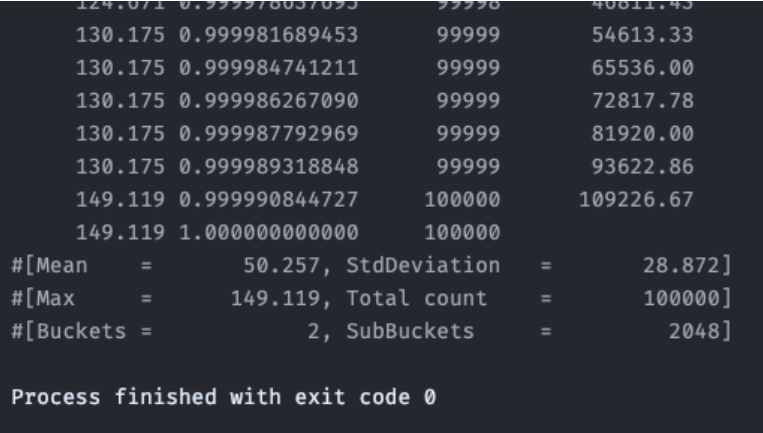
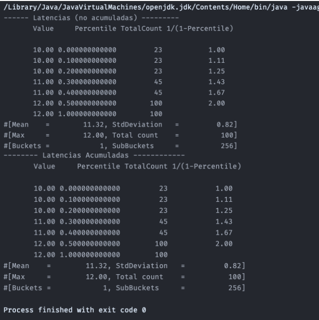
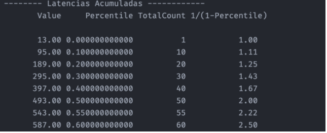
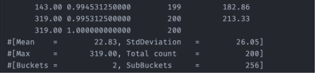
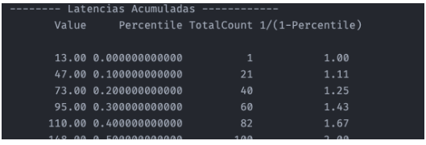
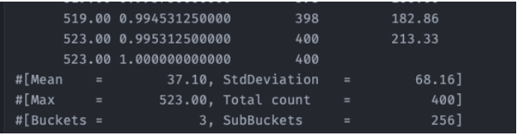
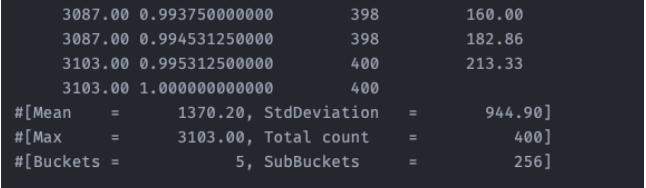

# ⚡ High-Performance Concurrency: Latency & Jitter Analysis

**Domain:** Low-Latency Systems, Fintech Engineering.
**Stack:** Java, HdrHistogram, Multi-threading, Maven.
**Context:** Advanced Academic Research (Master in Fintech Engineering).

> *An engineering analysis focusing on the difference between "Service Time" (Pure Latency) and "Response Time" (Accumulated Latency) under high-concurrency loads.*

---

## 🎯 Executive Summary
In high-frequency trading and real-time systems, averages are misleading. This project benchmarks **latency tail distributions (P99, P99.99)** to demonstrate how slight congestions in thread pools lead to exponential delays in execution.

---

## 📊 Module 1: Synchronous Latency Baselines
**Objective:** Establish a baseline for operation costs using `HdrHistogram` to capture nanosecond-precision timing without the "Coordinated Omission" problem.

### Key Findings
* Validated **Uniform Distribution** behavior in a controlled environment.
* **Benchmark Results:**
    * Mean Latency: ~50µs.
    * Max Jitter: ~149µs (due to OS scheduling/GC pauses).
    * Statistical convergence with theoretical variance $\sqrt{(b-a)^2/12}$.

 

 

*(Theoretical vs Real-world distribution analysis)*
 

---

## 🚀 Module 2: Concurrency & Resource Contention
**Objective:** Simulate a **Producer-Consumer** bottleneck. We compare a system under healthy load vs. saturated load to visualize the "Hockey Stick" latency curve.

### Scenarios Analyzed

#### A. Healthy State (1 Thread, 50 ops/s)
System is operating within capacity ($\lambda < \mu$).
* **Result:** Zero queue accumulation. Service time equals Response time.

 

 

 
---
 

#### B. The "Death Spiral" (Saturation)
When request rate exceeds service rate (Simulating 500 ops/s on a 10ms task).
* **Impact:** While *processing time* remains stable (~12ms), the **Queue Time** explodes.
* **Metric:** Latency Accumulation grows linearly with time, rendering the system unresponsive.

 

 

**Service Latencies (Stable):**
 

**Accumulated Latencies (Queue Explosion):**
 

 
---
 

#### C. Multi-Threaded Contention (Context Switching)
Scaling to multiple threads sharing a synchronized resource to analyze lock contention overhead.

**1. Scenario: 2 Threads**
`MAX_EXPECTED_EXECUTIONS_PER_SECOND = 50`

 

 

> **Analysis:** The mean latency is already **22.83ms**, which is greater than the arrival interval of **20ms**. Therefore, accumulated latencies are mathematically bound to increase.

 

 

> **Result:** Mean accumulated latency reached **283ms**.

 

**2. Scenario: 4 Threads**
Moving directly to 4 Threads.
`MAX_EXPECTED_EXECUTIONS_PER_SECOND = 50`

 

> **Analysis:** Compared to the 2-thread scenario, the mean has risen considerably. Likewise, the P90 value and the accumulated variance have increased disproportionately.

 

 

> **Critical Conclusion:**
> * Mean Accumulated Latency: **1380.20ms**.
> * As observed, mean service latencies increased by less than 2x (due to lock overhead), but **accumulated latencies nearly tripled** compared to the 2-thread scenario.
> * **Takeaway:** To keep accumulated latencies low in this 4-thread configuration, `MAX_EXPECTED_EXECUTIONS_PER_SECOND` would need to be set significantly lower than 50 to account for coordination overhead.

---

## 🧠 Engineering Takeaways
1. **Never trust the Average:** The mean latency remained acceptable even when the system was effectively down for users (high P99).
2. **Coordinated Omission:** Standard benchmarks often miss the time requests spend "waiting" to start. Tracking *Accumulated Latency* is critical for SLA compliance in Fintech.
3. **Capacity Planning:** For strict latency requirements (e.g., market data feeds), the `MAX_EXPECTED_EXECUTIONS` must be kept significantly below the theoretical throughput to absorb Jitter.