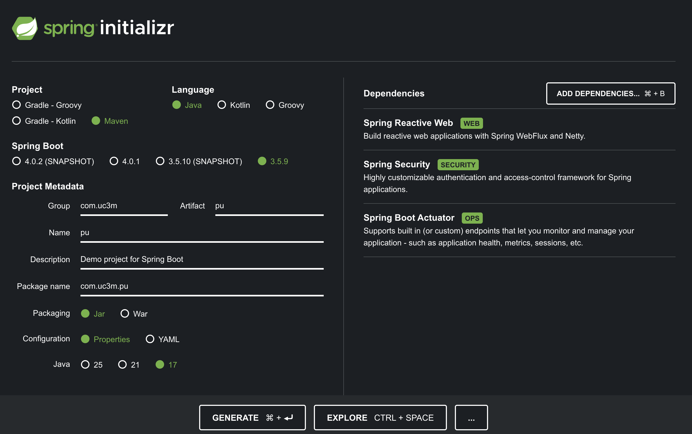
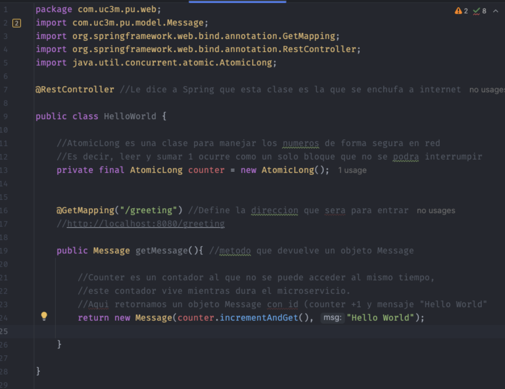
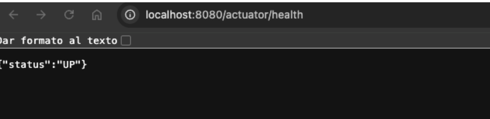
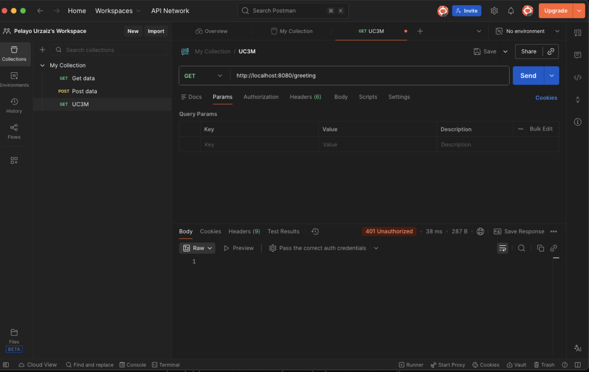
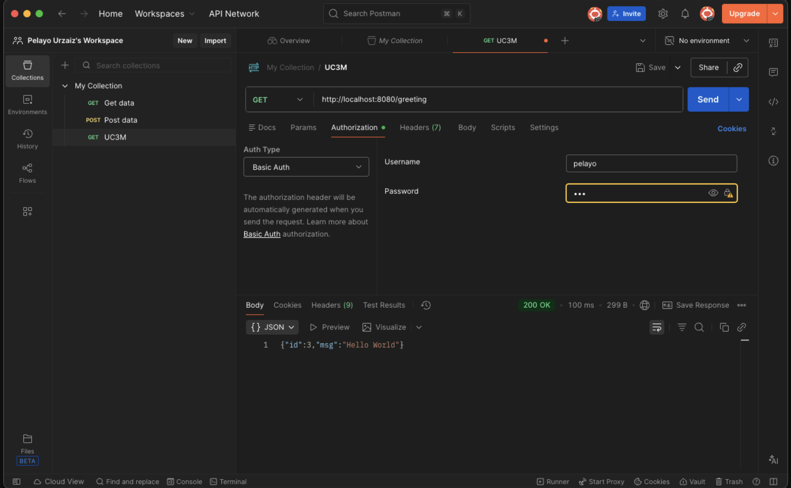

# FinTech Microservice: Secure REST API with Spring Boot

This project is part of my **Master's in FinTech at UC3M**. It demonstrates the implementation of a secure microservice using **Spring Boot**, designed for financial environments where data access control and monitoring are critical.

## 🚀 Project Overview & Key Technologies
This lab focuses on building a robust backend service covering:
* **Java 17 & Maven**: Core development stack.
* **Spring Boot 3.x**: For rapid application development.
* **Spring Security**: Implementing **Basic Authentication** to secure endpoints.
* **Spring Actuator**: Providing production-ready features like health checks and metrics.

---

## 🛠️ Implementation Details

### 1. Project Setup & Dependencies
*Initial setup using Spring Initializr, selecting dependencies for Web, Security, and Actuator.*

### 2. Core Logic (Controller & Model)
*The `HelloWorld` controller exposes a secured GET endpoint `/greeting`, returning a JSON object with a counter and message.*

---

## ✅ Testing & Validation (Postman)

The API was rigorously tested to ensure security policies are enforced.

### 1. Health Check (Actuator)
*Verifying the application status using the exposed actuator endpoint.*

### 2. Security Test: Unauthorized Access (401)
*Demonstrates that requests without valid credentials are blocked by Spring Security.*

### 3. Security Test: Authorized Access (200 OK)
*Successful response after providing valid Basic Auth credentials (user/password).*

---

## ⚙️ How to Run
1.  Clone the repository into your existing project structure.
2.  Navigate to the project folder.
3.  Run using Maven wrapper: `./mvnw spring-boot:run`