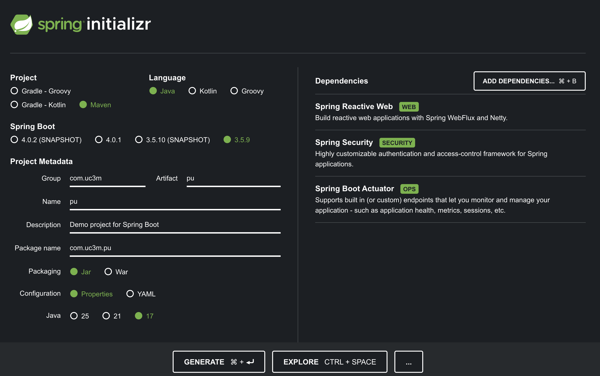
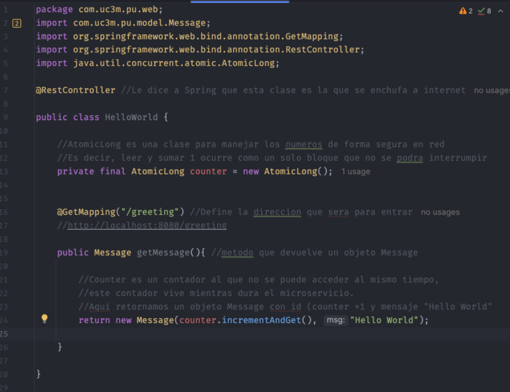
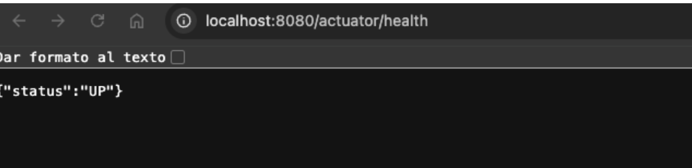
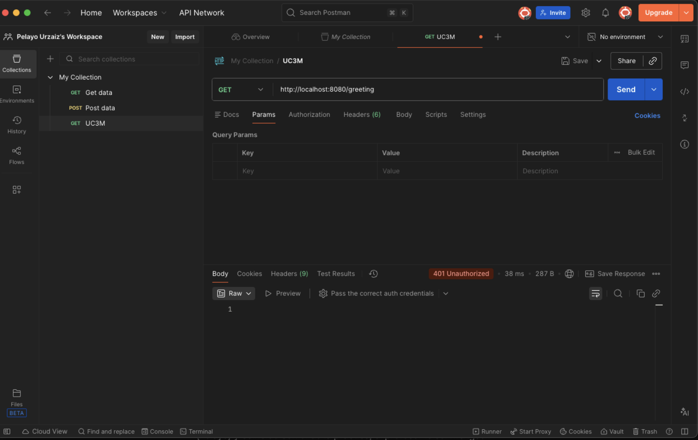
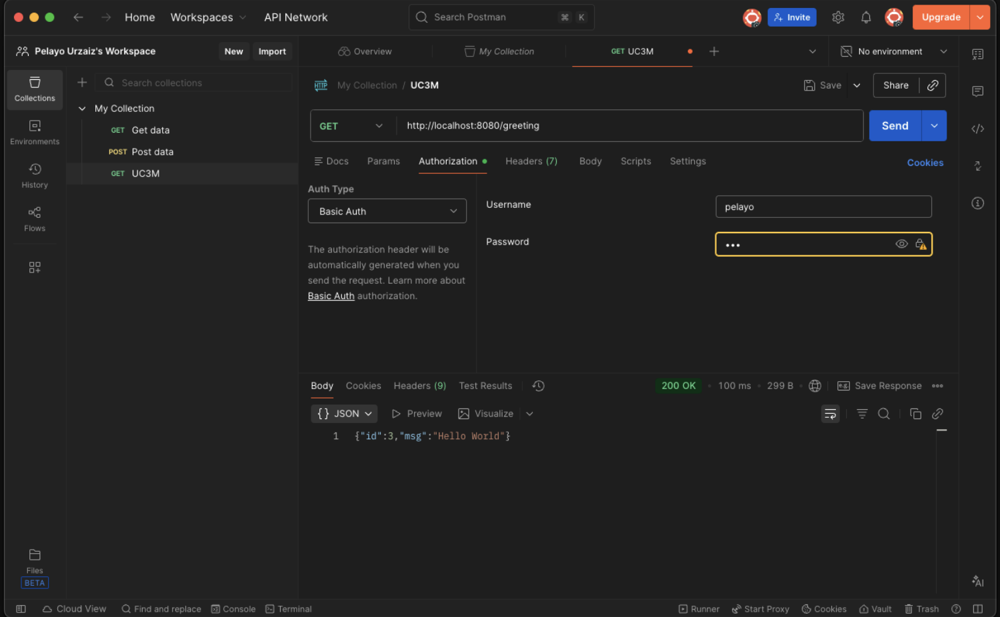

# Spring Boot Secure REST API — Basic Auth + Actuator

A minimal **Spring Boot 3** microservice that exposes a counter-backed JSON endpoint, secures it with **HTTP Basic Authentication** via Spring Security, and exposes a production-style health check through **Spring Boot Actuator**. Builds the smallest possible footprint that is still recognisable as a financial-grade service: authenticated access, stable health surface, observable counters.

---

## What this project does

- **`GET /greeting`** — returns `{ "id": <atomic counter>, "msg": "Hello World" }`. The counter is process-local, increments on every successful call, and is shared across requests via an `AtomicLong`.
- **HTTP Basic Authentication** — every endpoint is protected by Spring Security with credentials configured in `application.properties`. Requests without credentials get a `401 Unauthorized`; valid credentials get a `200 OK`.
- **Actuator health probe** — `GET /actuator/health` returns `{ "status": "UP" }`, the same shape used by container orchestrators (Kubernetes liveness/readiness, ECS targets, load-balancer health checks).

---

## Tech stack

| Area | Choice |
|------|--------|
| Language | Java 17 |
| Build | Maven (with bundled wrapper) |
| Framework | Spring Boot 3.x |
| Security | Spring Security — HTTP Basic |
| Observability | Spring Boot Actuator |

---

## Quick start

**Requirements:** Java 17+, no Maven install needed (the Maven wrapper is bundled).

```bash
./mvnw spring-boot:run
```

The application starts on `http://localhost:8080`. Default credentials live in `src/main/resources/application.properties`:

```properties
spring.application.name=pu
spring.security.user.name=pelayo
spring.security.user.password=123
```

Quick smoke test:

```bash
# Without credentials — 401
curl -i http://localhost:8080/greeting

# With credentials — 200 OK + JSON
curl -i -u pelayo:123 http://localhost:8080/greeting

# Health probe — public on this profile
curl -s http://localhost:8080/actuator/health
```

---

## Project layout

```
src/main/java/com/uc3m/pu/
├── PuApplication.java     # Spring Boot entry point
├── web/
│   └── HelloWorld.java    # @RestController exposing GET /greeting
└── model/
    └── Message.java       # record(long id, String msg) — JSON payload
```

`Message` is a Java `record`, so Jackson serialises it directly without explicit getters or a builder. `HelloWorld#getMessage()` is the only piece of business logic — everything else is auto-configured by Spring Boot starters.

---

## Walkthrough

### 1. Project bootstrap

Generated from Spring Initializr selecting **Web**, **Security** and **Actuator**.



### 2. Controller and model

`HelloWorld` exposes a `@GetMapping("/greeting")` that returns a fresh `Message` on every call, with the id sourced from a thread-safe `AtomicLong`:



### 3. Health check via Actuator

Confirms the application is up and ready to serve traffic — the same probe a load balancer would call:



### 4. Security — unauthorized request blocked (401)

Requests without valid Basic Auth credentials are rejected by Spring Security before they reach the controller:



### 5. Security — authorized request accepted (200)

With valid credentials supplied via `Authorization: Basic ...`, the same request is served normally:



---

## Reference

Implementation of the practice **Lección 12 — Cloud Computing** of the Master in Financial Sector Technologies (UC3M), focused on the building blocks every cloud-deployed financial microservice needs: a stable contract, authenticated access, and a probe surface for orchestrators.
